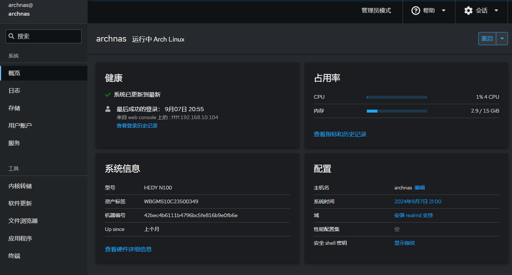

### 2.1.1 开启SSH服务

安装并开启openssh

```
pacman -S openssh
systemctl enable sshd && systemctl start sshd
```

安装好openssh之后就可以远程ssh登录到系统进行配置了。


**2.1.2 安装SSH客户端**

下载并安装MobaXterm客户端工具。

地址：[mobaxterm.download](https://mobaxterm.mobatek.net/download.html)

解压安装后打开MobaXterm

执行

sessions 》new Session 》 选择ssh标签

输入 remote host： nas主机的IP

输入 Special username：nas用户

点击 OK，进行登录


输入密码后进入shell界面。表示登录成功。


**1.8.1 设置主机名**

```
sudo bash -c 'echo "archnas" > /etc/hostname'
```

### 2.3 安装intel平台文件

```
pacman -S intel-ucode
```


## 2.2 配置中文环境

切换到root用户

```
sudo su root
```

**2.2.1 配置时区**

配置时区并同步时钟

```shell
ln -sf /usr/share/zoneinfo/Asia/Shanghai /etc/localtime
hwclock --systohc
```

**2.2.2 配置地区**

编辑/etc/locale.gen，编辑/etc/locale.conf

```
echo "en_US.UTF-8 UTF-8" >> /etc/locale.gen
echo "zh_CN.UTF-8 UTF-8" >> /etc/locale.gen
echo LANG=en_US.UTF-8 >> /etc/locale.conf
```

执行 locale-gen生成语言配置

```
# locale-gen
```

执行 loacale查看配置结果

```
# locale
```

**2.2.3 安装中文字体**

```
pacman -S ttf-dejavu wqy-microhei 
```

### 2.3 更新并升级系统

```
# 同步软件包库
pacman -Syy

# 更新系统
pacman -Syu
```

### 2.4 安装AUR包管理器

安装paru

```
sudo pacman -S git
sudo su archnas 
cd ~
git clone https://aur.archlinux.org/paru.git
cd paru
makepkg -si
```

### 2.5 安装web管理工具

安装cockpit

```
paru  cockpit 
paru  cockpit-pcp 
paru cockpit-storaged 
paru cockpit-files 
paru cockpit-packagekit
sudo systemctl start cockpit.socket && sudo systemctl enable cockpit.socket 
```

访问

[https://nas的Ip:9090/](https://nas%E7%9A%84Ip:9090/)

使用系统用户密码登录 
页面如下：

