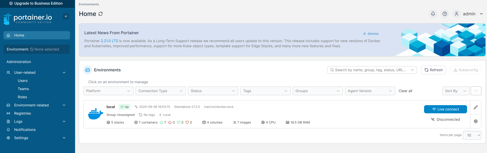
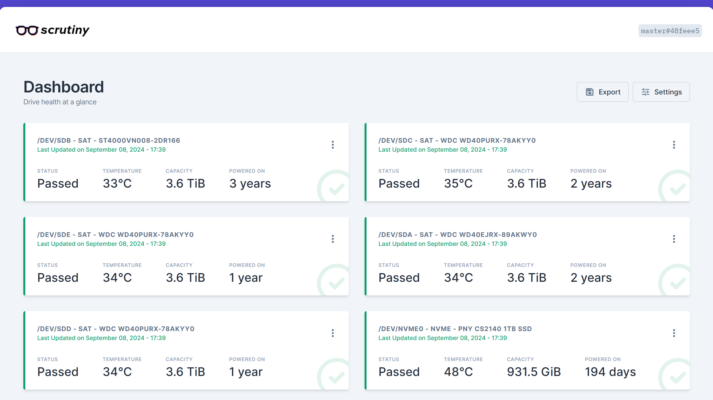
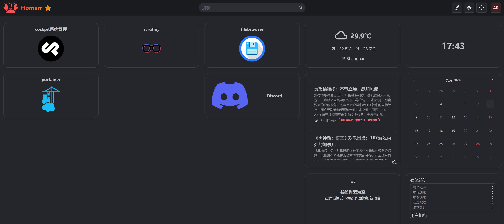

## 5.1 安装Docker

**5.1.1 安装docker**

```
pacman -S docker docker-compose
sudo systemctl start docker && sudo systemctl enable docker 
docker info
```

**5.1.2 docker命令**

docker镜像操作

```
# 查看所有镜像
docker images

# 搜索镜像
docker search image名称

# 下载镜像
docker pull [镜像名称]:[tag版本号]

# 删除镜像
docker rmi -f [镜像ID]
```

docker容器操作

```
# 显示所有容器
docker ps -a

# 显示所有运行容器
docker ps

# 运行容器
docker run -it [镜像名称/镜像ID]

# 启动容器
docker start [容器ID]

# 停止容器
docker stop [容器ID]

# 删除容器
docker rm [容器ID]

# 查看容器日志
docker logs -f [容器ID]

# 查看容器内部
docker inspect [容器ID]

# 进入容器bash
docker exec -it [容器ID] bash
```

**5.1.3 安装Docker管理工具Portainer**

Portainer是一个Docker的webUI管理服务

a) 安装Portainer

```
docker search portainer
docker pull portainer/portainer-ce:latest
```

b) 使用docker-compose配置文件运行

```
mkdir -p /nas/portainer/data
vim /nas/portainer/docker-compose.yml


---
version: "2.1"
services:
  portainer:
    image: portainer/portainer-ce
    container_name: portainer
    privileged: true
    restart: unless-stopped
    volumes:
      - /var/run/docker.sock:/var/run/docker.sock
      - /nas/portainer/data:/data
    ports:
      - 8000:8000
      - 9443:9443
```

运行服务
docker-compose up -d

c）手动命令运行：可选

```
mkdir -p /nas/portainer/data
docker run -d -p 8000:8000 -p 9443:9443  \
--name portainer --restart=unless-stopped -v \
/var/run/docker.sock:/var/run/docker.sock \
-v /nas/portainer/data:/data \
portainer/portainer-ce
```

访问地址

https://nas地址:9443/

第一次登录修改admin的密码（密码长度大于12位）



### 5.2 部署Docker服务

**5.2.2 安装硬盘监控工具scrutiny**

docker-compose

```
mkdir -p /nas/scrutiny/
vim /nas/scrutiny/docker-compose.yml

---
version: "2.1"
services:
  scrutiny:
    image: ghcr.io/analogj/scrutiny:master-omnibus
    container_name: scrutiny
    privileged: true
    restart: unless-stopped
    cap_add:
      - SYS_RAWIO
    environment:
      - PUID=1000
      - PGID=1000
      - TZ=Asia/Shanghai
    volumes:
      - /nas/scrutiny/config:/opt/scrutiny/config
      - /nas/scrutiny/influxdb:/opt/scrutiny/influxdb
      - /run/udev:/run/udev:ro
    ports:
      - 8180:8080
      - 8186:8086
    devices:
      - /dev:/dev
```

启动服务

```
sudo docker-compose up -d
```

访问地址：
http://nas地址:8180/



**5.2.1 安装导航页Homarr**

创建

```
mkdir -p /nas/homarr
vim /nas/homarr/docker-compose.yml

---

version: '3'
services:
  homarr:
    image: ghcr.io/ajnart/homarr:latest
    container_name: homarr
    privileged: true
    restart: unless-stopped
    volumes:
      - /var/run/docker.sock:/var/run/docker.sock 
      - /nas/homarr/configs:/app/data/configs
      - /nas/homarr/icons:/app/public/icons
      - /nas/homarr/data:/data
    ports:
      - '7575:7575'
```

运行：

> docker-compose up -d

访问

http://nas地址:7575/

第一次需要创建管理员用户（archnas/密码）

进入管理页面定制你的配置。

