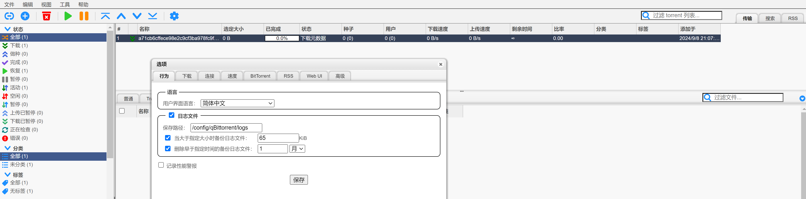

### 6.1 安装web文件浏览器


### 6.2 安装私有云盘：nextcloud

**6.1.1 安装私有云盘nextcloud**

安装nextcloud
```
mkdir -p /nas/nextcloud/data
vim /nas/nextcloud/docker-compose.yml

---
version: '2'
services:
  nextcloud:
    image: nextcloud
    container_name: nextcloud
    privileged: true
    restart: unless-stopped
    ports:
      - 8380:80
    volumes:
      - /nas/nextcloud/data:/var/www/html
```


启动服务
```
sudo docker-compose up -d
```

打开地址

http://nas地址:8380/

第一次登录需要创建管理员账号（admin/密码）

然后用管理员账号登录，创建普通用户账号


**6.2.2 Nextcloud手机客户端**

在应用商店下载Nextcloud客户端应用。

下载页面：https://nextcloud.com/install/


打开Nextcloud客户端, 输入下面的地址作为服务连接地址：

http://nas地址:8380/

继续进入到连接页面，继续输入创建的账号密码登录


### 6.3 安装BT下载工具:qbittorrent

**6.3.1 安装qbittorrent**
安装qbittorrent
```
mkdir -p /nas/qbittorrent/appdata
mkdir -p /nas/downloads


docker pull lscr.io/linuxserver/qbittorrent:latest
vim /nas/qbittorrent/docker-compose.yml

---
services:
  qbittorrent:
    image: lscr.io/linuxserver/qbittorrent:latest
    container_name: qbittorrent
    restart: unless-stopped
    environment:
      - PUID=1000
      - PGID=1000
      - TZ=Asia/Shanghai
      - WEBUI_PORT=8480
      - TORRENTING_PORT=16881
    volumes:
      - /nas/qbittorrent/appdata:/config
      - /nas/downloads:/downloads #optional
    ports:
      - 8480:8480
      - 16881:16881
      - 16881:16881/udp

```      
 
启动服务
```
sudo docker-compose up -d
```

打开地址

http://nas地址:8480/

默认账号密码为 admin

密码需要去容器内打印查看
```
sudo docker logs qbittorrent | grep password    #查看密码
```


使用admin/日志密码，登录成功后修改默认密码。


**6.3.2 配置qbittorrent**

Tool - options-设置
1）修改admin密码
2）修改语言中文
3）下载排队数量改大
4）分享率改为1
5）启用RSS订阅

