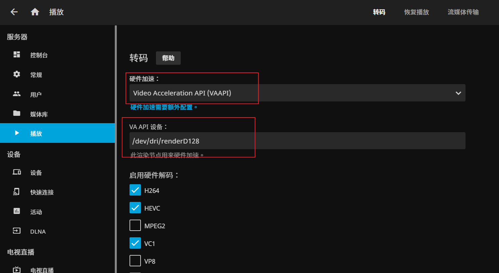

### 1.7 Arch搭建Nas系统之七：影音服务

**1.7.1 安装jellyfin**

准备驱动目录和字体文件

```
mkdir -p /nas/jellyfin/config
mkdir -p /nas/jellyfin/cache


#查看是否有硬解驱动
ls /dev/dri/


# 下载中文思源字体

mkdir -p /nas/jellyfin/config/fonts
cd /nas/jellyfin/config/fonts
wget -O Source_Han_Sans_CN_Regular.woff2  https://raw.githubusercontent.com/lsdlyz/Source-Han-Sans-CN-Regular/master/SourceHanSansCNRegular/Source%20Han%20Sans%20CN%20Regular.woff2

wget -O Source_Han_Sans_CN_Regular.ttf https://raw.githubusercontent.com/lsdlyz/Source-Han-Sans-CN-Regular/master/SourceHanSansCNRegular/Source%20Han%20Sans%20CN%20Regular.ttf
```

安装

```
sudo docker pull jellyfin/jellyfin

vim /nas/jellyfin/docker-compose.yml
---
services:
  jellyfin:
    image: jellyfin/jellyfin
    container_name: jellyfin
    user: 1000:1000
    restart: 'unless-stopped'
    volumes:
      - /nas/jellyfin/config:/config
      - /nas/jellyfin/cache:/cache
      - type: bind
        source: /data
        target: /media
        read_only: true
    devices:
      - /dev/dri/:dev/dri/    
    ports:
      - 8096:8096
```


**7.1.3 复制字体,解决封面乱码**


```
cd /nas/jellyfin/config/fonts
sudo docker cp Source_Han_Sans_CN_Regular.ttf jellyfin:/usr/share/fonts/truetype/dejavu
sudo docker restart jellyfin
```

运行服务

docker-compose up -d

访问地址：

http://192.168.10.222:8096/

**7.1.2 配置jellyfin**

打开管理页面，第一步需要添加服务器地址。

然后刷新

http://192.168.10.222:8096/

进行初始化配置

选择汉语

初始化后管理员用户

然后使用管理员账号登录

配置
1）播放-转码。开启硬件加速，开启硬件解码

> 硬件加速开启，选VAAP

> AV1不使用硬件解码

> 允许以 HEVC 格式编码 不勾选
> 允许以 AV1 格式编码 不勾选

配置字体，解决字幕乱码

2) 播放-转码。

选择上传的中文字体 /config/fonts目录
勾选开启备用字体





**7.1.3 添加媒体库**

媒体库-》媒体库-》添加媒体库

1）电影

勾选启用媒体库
首选下载语言：chinese
国家：china
自动从互联网获取元数据并刷新：不勾选
元数据存钱方式：勾选NFO


2）电视


3）

**7.1.4 安装jellyfin客户端工具**

## 客户端工具

PC端：浏览器，页面访问

苹果：jellyfin客户端

安卓：jellyfin客户端

电视：kodi + jellyfin插件

## 安装音乐库

mkdir -p /nas/navidrome
vim   /nas/navidrome/docker-compose.yml

```
version: "2.1"
services:
  navidrome:
    image: deluan/navidrome:latest
    ports:
      - "4533:4533"
    environment:
      # Optional: put your config options customization here. Examples:
      ND_SCANSCHEDULE: 24h
      ND_LOGLEVEL: info  
      ND_BASEURL: ""
    volumes:
      - "/nas/navidrome/data:/data"
      - "/data/music:/music:ro"
    restart: unless-stopped  
```

运行

docker-compose up -d

访问地址：

http://192.168.10.222:4533/


第一次创建管理员用户和密码
账号：admin/密码

客户端工具：amperfy
