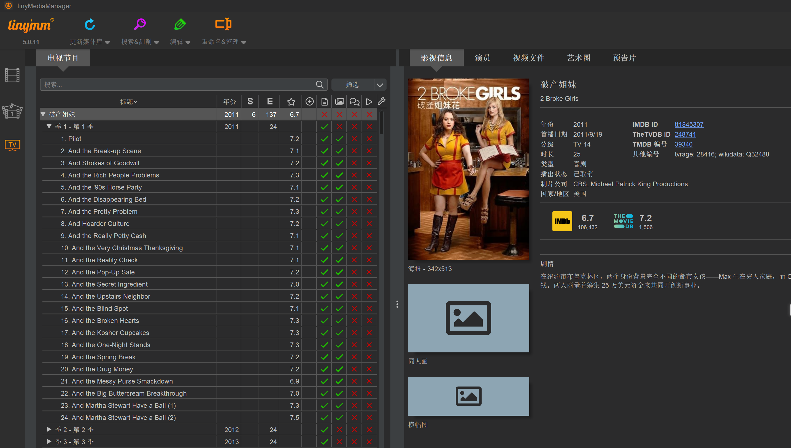
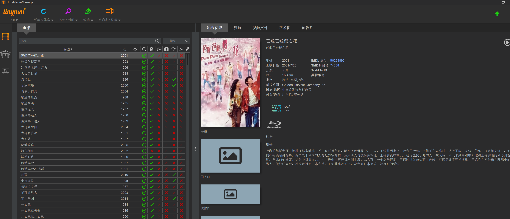
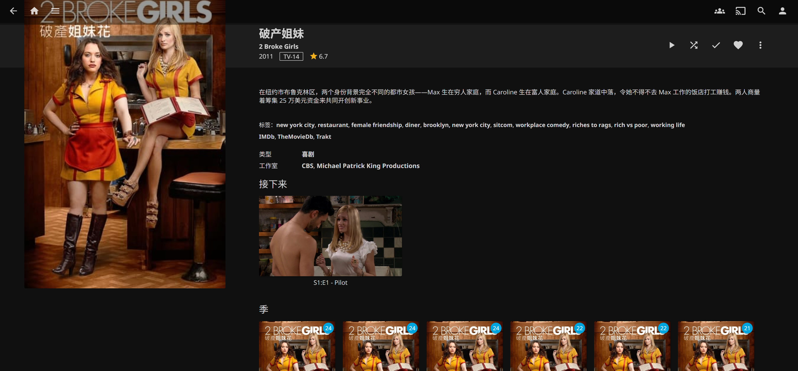
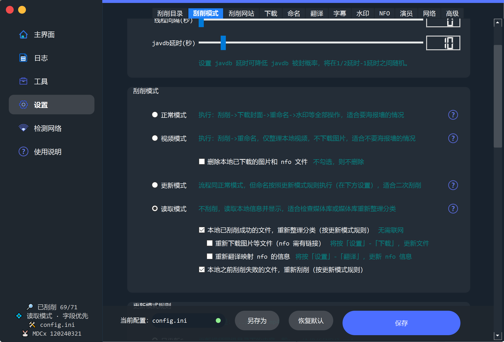
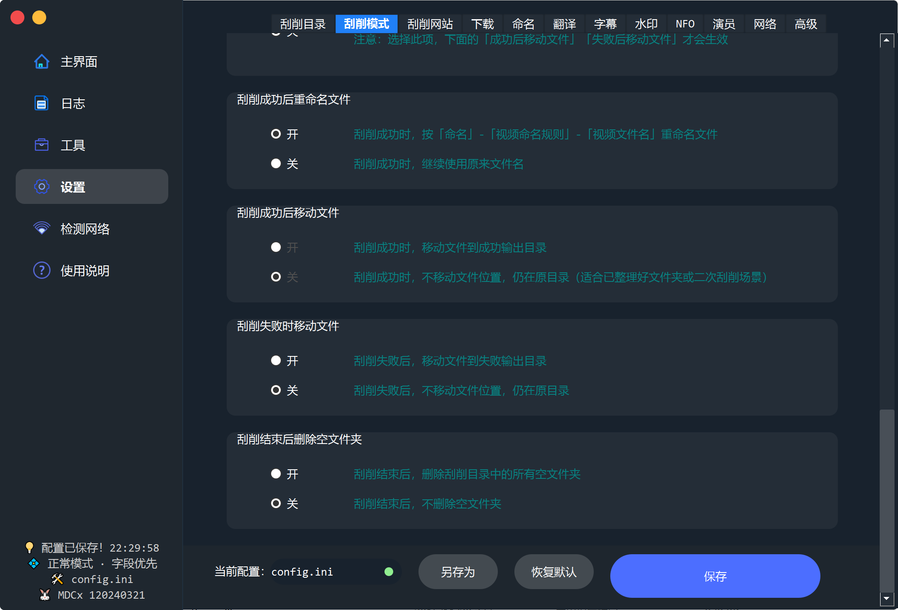
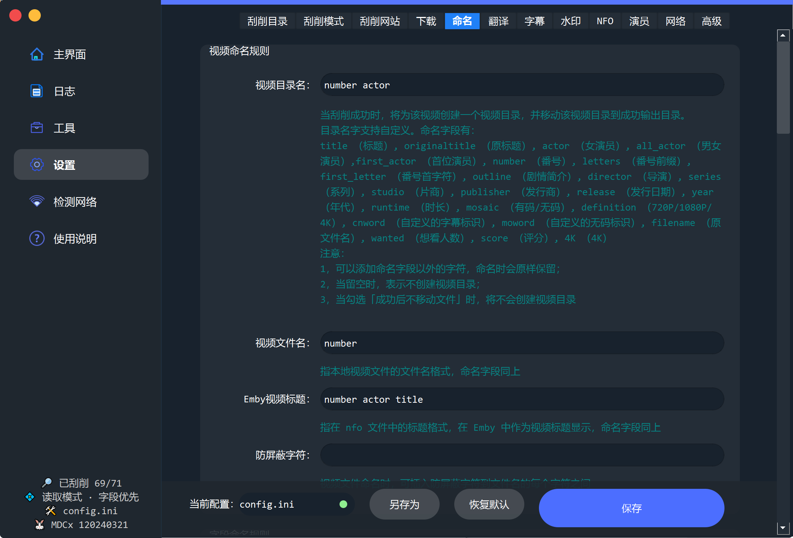
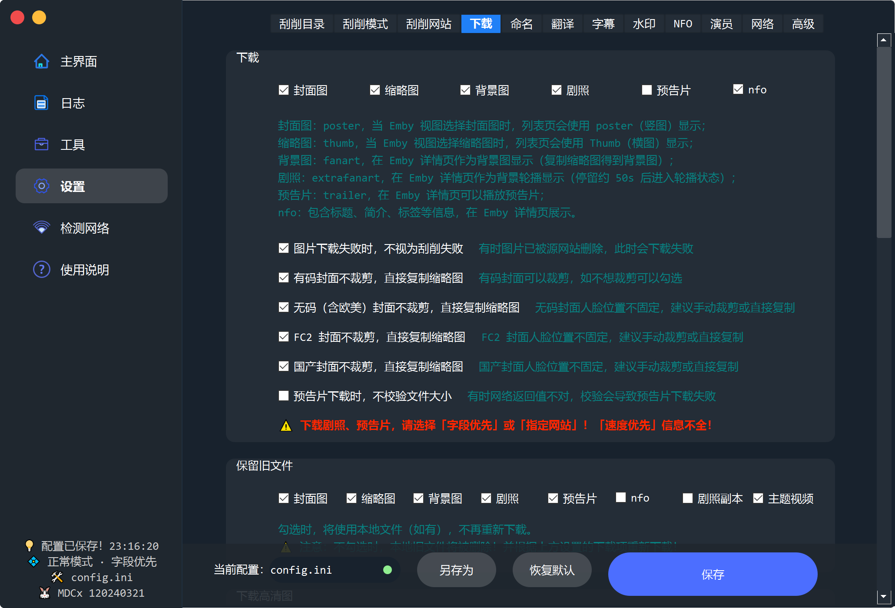
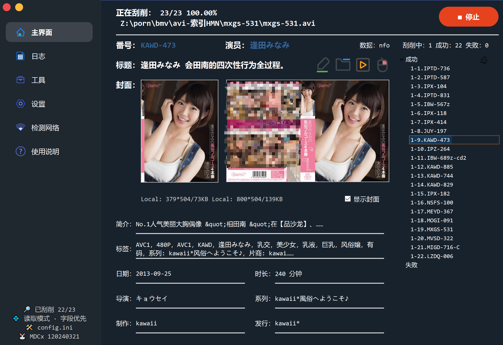
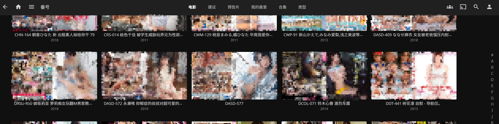

## 1 影音元数据

1）首先介绍一个影音元数据库的网站TMDB。

https://www.themoviedb.org/

注册账号并获取api的key

2）字幕网站

https://www.opensubtitles.com/

注册账号并获取api的key

3）关于刮削的文件命名

基本信息：

原剧集语言 
固定演员

参考：

https://www.bilibili.com/read/cv3275648/

https://www.luxiyue.com/personal/%E4%B8%80%E6%96%87%E6%90%9E%E6%87%82%E7%94%B5%E5%BD%B1%E6%96%87%E4%BB%B6%E5%91%BD%E5%90%8D%E8%A7%84%E5%88%99/

https://blog.iplayloli.com/sharing-of-tinymeediamanger-renaming-rules.html

### 8.4 影视刮削工具

下载刮削工具 TinyMediaManager 

下载地址：https://www.tinymediamanager.org/

批量重命名工具 Advance Renamer

下载地址：https://www.advancedrenamer.com/

### 8.2 影音命名规则

影音分为两种。
1）MOVIE：电影
2）TVSHOW：剧集（例如连续剧或者番剧）

**8.2.1电影命名规则**

文件夹命名为
影片名称（年份）

电影命名：
电影中文名.电影原始名.发行年份.分辨率.影片来源.影片编码.影片格式
加勒比海盗2：聚魂棺.Pirates.of.the.Caribbean.Dead.Mans.Chest.2006.BluRay.720p.x264.AC3-WOFEI.mkv

**8.2.1剧集命名规则**

Friends.S03E10.1080p.x264.mkv
节目名称.第几季第几集.分辨率.影片编码.视频格式

### 8.3 字幕编辑

subtitleEdit 字幕编辑

.default.字母格式: 在文件名末尾附加字幕来将字幕标记为默认字幕

## 8.4 刮削后整理：重命名

**8.4.1 电影**
文件夹重命名配置：

${title}${ - ,edition,} (${,year,})

文件命名配置：
${title}${if !movie.title=movie.originalTitle}${.originalTitle}${end}${.,year,}${.,edition,}${.,mediaSource,}${.,videoFormat,}${.,videoCodec,}.${videoBitDepth}bit.${.,audioCodec;upper,}

**8.4.2电视**

1）文件夹重命名配置：
${showTitle} (${showYear})

2）特别篇或者OVA目录
文件命名配置：
Specials

3）季命名
Season ${seasonNr}

3）文件命名
${tvShow.title}${if !tvShow.title=tvShow.originalTitle}${.,tvShow.originalTitle,}${end}.S${seasonNr2}E${episodeNr2}${.,videoFormat,;replace(format.csv)}${.,videoCodec,;replace(codec.csv)}

第几季第几集用S季数E集数表示
例如，第八季第五集: S08E05

4) 特别篇或者OVA目录文件
季命名以S00开始

好的文件命名是决定刮削是否准确的关键

效果如图

## 1.9 番号整理

### 1.9.1 软件下载安装

使用MDXC进行番号刮削

项目地址：
https://github.com/sqzw-x/mdcx

下载地址：
https://github.com/sqzw-x/mdcx/releases/tag/120240321

配置如下：

具体不能多说了，自己研究吧。展示下刮削效果

### 1.9.2 番号命名规则

刮削前文件名称整理
1. 目录名称不动
2. 文件名称修改为番号名称

刮削重命名配置

1. 目录名称不动
2. 文件名称修改为番号名称

## 音乐刮削

下载Music Tag音乐标签客户端
（或者Mp3Tag，需要自己配置源）

文件-添加目录：添加音乐目录

工具栏-点击自动匹配标签：自动匹配项，除了标题和艺术家都选上

文件-重命名：按照 （艺术家 - 标题） 命名
