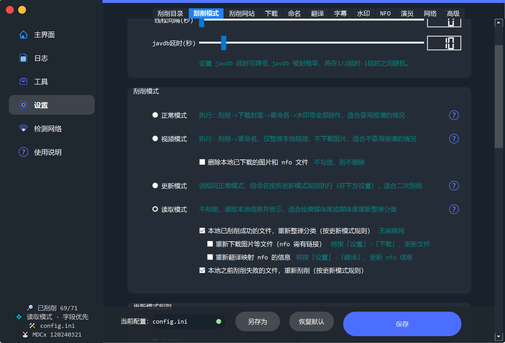
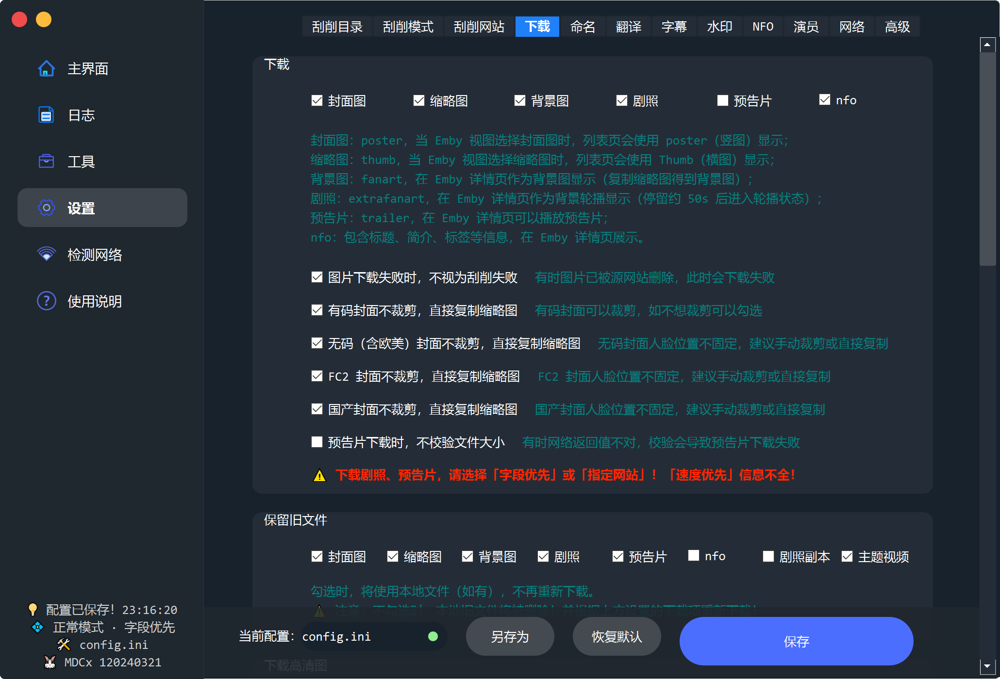

## 1.9 番号整理

### 1.9.1 软件下载安装

使用MDXC进行番号刮削

项目地址：
https://github.com/sqzw-x/mdcx

下载地址：
https://github.com/sqzw-x/mdcx/releases/tag/120240321

配置如下：

具体不能多说了，自己研究吧。展示下刮削效果

### 1.9.2 番号命名规则

刮削前文件名称整理
1. 目录名称不动
2. 文件名称修改为番号名称

刮削重命名配置

1. 目录名称不动
2. 文件名称修改为番号名称

