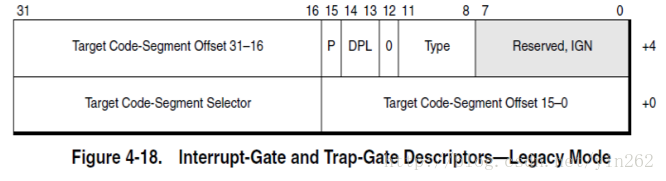

### 中断描述符表

在实模式下，我们对设备的访问操作其实是通过BIOS进行的。中断向量号由BIOS提供，BIOS控制进行中断控制访问。

进入保护模式后，就和BIOS脱离关系了，此时我们需要重新建立中断描述符表，建立中断描述符表，其中中断向量号由CPU提供。由CPU控制和硬件之间的交互。

**1）中断向量表**

实模式下中断：实模式中断是根据ivt中断向量表

**2）中断描述符表**

保护模式下的中断，根据IDT中断描述符来判断处理

### IDT中断描述符表

内容：

- 中断门                                                    描述符
- 任务门描述符
- 陷阱门描述符
- 调用门描述符

格式：

1）idt 描述符：和gdt一样，大小为48位，前16位是idt表界限，后32位是idt的线性基地址

2）中断描述符：大小位 8个字节（64位）

3) 使用lidt指令加载数据

### 

每个entry为8bytes，有以下关键bit： 

 0~15 & 46-64：segment offset （根据以上两项可确定中断处理函数的地址） 

 P（1位）：该描述符是否在内存中

 DPL（2位）：Descriptor Privilege Level， 访问特权级 

 S（1位）: 默认为0，表示系统段

 Type（4位）：区分中断门、陷阱门、任务门等 ，

> 第一位D代表0表示16位模式，1表示32位模式。默认32位值为1
>
> 后三位代表什么门
>
> type：110中断门
>
> type：101 任务门
>
> type：111陷阱门
>
> type：100调用门
>
>

 16~31：code segment selector ，选择子

### 80x86

| I/O ADDR | INT TYPE（16进制） | FUNCTION                                                 |
| -------- | ------------------ | -------------------------------------------------------- |
| 00 ~ 03  | 0                  | 除法溢出中断                                             |
| 04 ~ 07  | 1                  | 单步(用于DEBUG)                                          |
| 08 ~ 0B  | 2                  | 非屏蔽中断(NMI)                                          |
| 0C ~ 0F  | 3                  | [断点](https://baike.baidu.com/item/断点)中断(用于DEBUG) |
| 10 ~ 13  | 4                  | 溢出中断                                                 |
| 14 ~ 17  | 5                  | 打印屏幕                                                 |
| 18 ~ 1F  | 6/7                | 保留                                                     |

### 8259主片

| I/O ADDR | INT TYPE（16进制） | FUNCTION               |
| -------- | ------------------ | ---------------------- |
| 20 ~ 23  | 8                  | 定时器（IRQ0）         |
| 24 ~ 27  | 9                  | 键盘（IRQ1）           |
| 28 ~ 2B  | A                  | 彩色/图形（IRQ2）      |
| 2C ~ 2F  | B                  | 串行通信COM2（IRQ3）   |
| 30 ~ 33  | C                  | 串行通信COM1（IRQ4）   |
| 34 ~ 37  | D                  | LPT2控制器中断（IRQ5） |
| 38 ~ 3B  | E                  | 磁盘控制器中断（IRQ6） |
| 3C ~ 3F  | F                  | LPT1控制器中断（IRQ7） |

### BIOS

| I/O ADDR | INT TYPE（16进制） | FUNCTION                                                     |
| -------- | ------------------ | ------------------------------------------------------------ |
| 40 ~43   | 10                 | 视频显示 I/O                                                 |
| 44 ~ 47  | 11                 | 设备检验                                                     |
| 48 ~ 4B  | 12                 | 测定[存储器](https://baike.baidu.com/item/存储器)容量        |
| 4C ~ 4F  | 13                 | 磁盘 I/O                                                     |
| 50 ~ 53  | 14                 | [RS-232](https://baike.baidu.com/item/RS-232) [串行口](https://baike.baidu.com/item/串行口) I/O |
| 54 ~ 57  | 15                 | 系统描述表[指针](https://baike.baidu.com/item/指针)          |
| 58 ~ 5B  | 16                 | 键盘 I/O                                                     |
| 5C ~ 5F  | 17                 | 打印机 I/O                                                   |
| 60 ~ 63  | 18                 | ROM BASIC 入口代码                                           |
| 64 ~ 67  | 19                 | 引导装入程序                                                 |
| 68 ~ 6B  | 1A                 | 日时钟                                                       |

### 提供用户中断

| I/O ADDR | INT TYPE（16进制） | FUNCTION                                                     |
| -------- | ------------------ | ------------------------------------------------------------ |
| 6C ~ 6F  | 1B                 | Ctrl - Break 控制的[软中断](https://baike.baidu.com/item/软中断) |
| 70 ~ 73  | 1C                 | [定时器](https://baike.baidu.com/item/定时器)控制的[软中断](https://baike.baidu.com/item/软中断) |
| 74 ~ 77  | 1D                 | 视频参数块                                                   |
| 78 ~ 7B  | 1E                 | 软盘参数块                                                   |
| 7C ~ 7F  | 1F                 | 图形字符扩展码                                               |