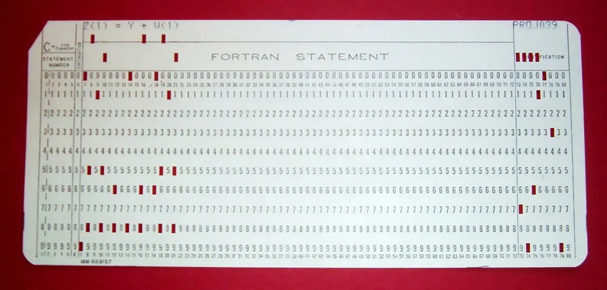

## 1 数据的描述

对于计算机来说，能识别的只有0和1两个数字。使用0和1这种二进制，位数足够，其实就可以描述无限可能性的数据、

例如穿孔纸带是早期计算机的储存介质，它将程序和数据转换二进制数码：带孔为1，无孔为0，经过光电输入机将数据输入计算机。

内存中的内容是0和1表示的。
内存内容可以具体分为两类：
1）数据内容
2）指令内容

而指令内容，就是具体提供给CPU执行的内容。

## 2 十进制，二进制，十六进制

### 十进制，二进制，十六进制
**十进制**（Decimal ）
是一种计数方法，即满十进一，十进制计数法是日常使用最多的计数方法，每相邻的两个计数单位都为十的计数法则。十进制一般用字母**D**表示。

例如：100、88、36753

**二进制**（Binary ）
是在数学和数字电路中以2为基数的记数系统，它只有两个符号：0（代表零）和1（代表一）。这一系统是现代‌计算机和依赖计算机的设备里所使用的数制。

例如 ：1101、11

**十六进制** （hex）
是一种基数为16的计数系统，通常用数字0、1、2、3、4、5、6、7、8、9和字母A、B、C、D、E、F（a、b、c、d、e、f）表示、

c语言及其他相近的语言使用字首“0x”，开头的“0”令解析器更易辨认数，而“x”则代表十六进制。

例如：0xFF

### 2. 进制转换

使用linux的bc命令进行进制转换

10进制转2进制
echo 'obase=2;ibase=10;1000'|bc
输出：1111101000

10进制转16进制
echo 'obase=16;ibase=10;1000'|bc
输出：3E8

2进制转10进制
echo 'obase=10;ibase=2;1000'|bc
输出：8

16进制转10进制
echo 'obase=10;ibase=16;1000'|bc
输出：4096
