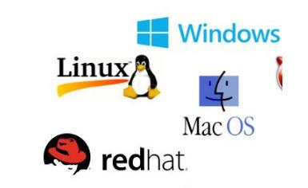

## 概述

相关资料：

**汇编**

**原理**

1 深入理解计算机系统

**实现**

1 操作系统真相还原

2 x86汇编语言-从实模式到保护模式

2 30天自制操作系统

3 Orange's一个操作系统的实现

4 程序员的自我修养

[如何从零开始写一个简单的操作系统？]

https://www.zhihu.com/question/25628124

https://www.zhihu.com/question/22463820

https://www.zhihu.com/question/36448683

[Bran's Kernel Development Tutorial]

http://www.osdever.net/bkerndev/Docs/gettingstarted.htm

[JamesM's kernel development tutorials] 

http://johnvidler.co.uk/mirror/jamesm-kernel-tutorial/

[JamesM's kernel development tutorials -cn ]

http://wiki.0xffffff.org

[How-to-Make-a-Computer-Operating-System]

https://github.com/SamyPesse/How-to-Make-a-Computer-Operating-System

[Xv6, a simple Unix-like teaching operating system]

https://pdos.csail.mit.edu/6.828/2011/xv6.html

https://pdos.csail.mit.edu/6.828/2014/index.html

https://pdos.csail.mit.edu/6.828/2014/xv6/book-rev8.pdf

https://pdos.csail.mit.edu/6.828/2014/xv6/xv6-rev8.pdf

[ranxian/xv6-chinese · GitHub ]

https://github.com/ranxian/xv6-chinese

[os67]

https://github.com/SilverRainZ/OS67

[ucore]

 https://github.com/chyyuu/ucore_os_docs

