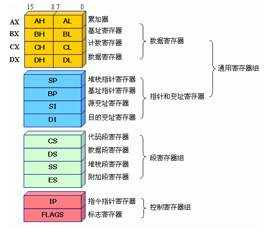

## CPU简介

[TOC]

### CPU的功能模块

CPU从逻辑上可以划分成3个模块，分别是控制单元、运算单元和存储单元，这三部分由CPU内部总线连接起来

1. 控制单元：控制单元是整个CPU的指挥控制中心，由指令寄存器IR(Instruction Register)、指令译码器ID(Instruction Decoder)和操作控制器OC(Operation Controller)

2. 运算单元：是运算器的核心。可以执行算术运算(包括加减乘数等基本运算及其附加运算)和逻辑运算(包括移位、逻辑测试或两个值比较)。

3. 存储单元：包括CPU片内缓存和寄存器组，是CPU中暂时存放数据的地方

简单的描述下CPU是如何进行计算的。

例如计算2个数的和：

首先，CPU的控制器从内存读取两条MOV指令，执行指令将内存的值赋值到两个不同的寄存器中。

然后。CPU的控制器从内存读取一条ADD指令，计算两个寄存器中数的和值。

计算的结果保存在第三个寄存器中，并将此寄存器的结果返回到内存中。

## cpu总线

1. 地址总线

CPU是通过地址总线来进行内存地址寻址的。8086cpu有20根地址总线,可以访问 1M (1<<20 )的内存空间。

CPU地址总线的位数决定了CPU的寻址能力。

2. 数据总线

CPU通过数据总线来进行内存和其他器件之间的数据传递。8086有16根数据总线，每次可以读写16位数据。

数据总线的宽度决定了CPU和外界的数据传输速度。

3. 控制总线

CPU通过控制总线发出各种控制命令，用来操作外部设备。

## CPU寄存器

说明：关于CPU寄存器的话，网上很多资料。这边只是做一个总结。

[http://zh.wikipedia.org/wiki/%E5%AF%84%E5%AD%98%E5%99%A8](http://zh.wikipedia.org/wiki/%E5%AF%84%E5%AD%98%E5%99%A8)

要编写操作系统，首先要熟悉CPU的结构，这样才能控制CPU完成自己想要的操作。CPU是由很多个寄存器构成的，通过汇编语言操作寄存器的数据，从而进行CPU的执行和运算。

CPU寄存器组可以分为通用寄存器组，段寄存器组，指令指针寄存器 和 标志寄存器。

### 16位cpu的寄存器组

8086 有14个16位寄存器，这14个寄存器按其用途可分为(1)通用寄存器-包括数据寄存器和指针寄存器、(2)指令指针寄存器、(3)标志寄存器和(4)段寄存器等4类。

#### CPU数存器组:

总共4个数据寄存器，2个指针寄存器以及2个变址寄存器，如下：

- 4个数据寄存器(AX、BX、CX和DX)
- 2个指针寄存器(SP和BP)
- 2个变址寄存器(SI和DI)

**通用寄存器**

| 名称 | 所属寄存器组            | 作用                                                         |
| ---- | ----------------------- | ------------------------------------------------------------ |
| AX   | 数据寄存器(accumulator) | 累加寄存器  1.作为数据寄存器  2.累加器可用于乘、除、输入/输出等操作 |
| BX   | 数据寄存器(base)        | 基址寄存器。 1.作为数据寄存器   2.可作为基址寄存器来使用，配合段寄存器寻址 |
| CX   | 数据寄存器(count)       | 1. 计数寄存器:在循环和字符串操作时，要用它来控制循环次数 2.位移寄存器:在位操作中，当移多位时，要用CL来指明移位的位数 |
| DX   | 数据寄存器(data)        | 1.在进行乘、除运算时，它可作为默认的操作数参与运算  2.用于存放I/O的端口地址 |

通用寄存器: AX，BX，CX，DX

大小为16位又可再拆分高低位使用，大小为8位：AH，AL，BH，BL，CH，CL，DH，DL。

| 寄存器（16位） | AX   | BX   | CX   | DX   |
| -------------- | ---- | ---- | ---- | ---- |
| 高位（8位）    | AH   | BH   | CH   | DH   |
| 低位（8位）    | AL   | BL   | CL   | DL   |

**1. 累加寄存器     AX**		-accumulator,累加寄存器。

> 作用：累加器可用于乘、除、输入/输出等操作，它们的使用频率很高

**2. 基址寄存器     BX**		-base 基址寄存器。存储器指针

> 作用：它可作为存储器指针来使用；

**3. 计数寄存器     CX**		-counter，计数寄存器。串操作，循环操作计数寄存器，其中的CL低位为移位操作计数器

> 作用：在循环和字符串操作时，要用它来控制循环次数；在位操作中，当移多位时，要用CL来指明移位的位数

**4. 数据寄存器     DX**		-data，数据寄存器。乘除运算

> 作用：在进行乘、除运算时，它可作为默认的操作数参与运算，也可用于存放I/O的端口地址

**指针寄存器（16位）**

| 名称 | 所属寄存器组                  | 作用           |
| ---- | ----------------------------- | -------------- |
| SI   | 变址寄存器(source index)      | 源变址寄存器   |
| DI   | 变址寄存器(destination index) | 目标变址寄存器 |
| ---  | ---                           | ---            |
| SP   | 栈指针寄存器(stack pointer)   | 栈指针寄存器   |
| BP   | 基数指针寄存器(base pointer)  | 基址指针寄存器 |

**指令指针寄存器**（16位）

| 名称 | 所属寄存器组   | 作用                                                         |
| ---- | -------------- | ------------------------------------------------------------ |
| IP   | 指令指针寄存器 | 指向当前需要取出的指令字节。IP指向的是指令地址的段内地址偏移量 |

**段寄存器组（16位）**

| 名称 | 所属寄存器组                | 作用                   |
| ---- | --------------------------- | ---------------------- |
| CS   | 代码段寄存器(code segment)  | 用于代码段内存位置寻址 |
| DS   | 数据段寄存器(data segment ) | 用于数据段内存位置寻址 |
| SS   | 栈段寄存器(stack segment)   | 用于堆栈内存位置寻址   |
| ES   | 附加段寄存器(extra segment) |                        |

**5. 标志寄存器（每个标志占一位）FLAGS**

| 名称 | 所属寄存器组               | 作用                         |
| ---- | -------------------------- | ---------------------------- |
| FR   | 标志寄存器(Flags Register) | 存放条件标志、控制标志寄存器 |

### 32位cpu的寄存器组

#### CPU数存器组:

后来出现的32位处理器在16位的基础上延伸到32位：

总共有4个32位的数据寄存器EAX、EBX、ECX和EDX。而这4个32位寄存器的低位和原先16位的一样，命名为：AX、BX、CX和DX。
2个指针寄存器，名称为ESP和EBP，
2个变址寄存器，名称为ESI和EDI。

**1. 通用寄存器组（32位）**

| ★名称              | ★作用  |      |           |           |
| ------------------ | ------ | ---- | --------- | --------- |
| 位数 | 32位   | 16位 | 8位（高） | 8位（低） |
| **通用寄存器组**| | | ||
| 累加寄存器         | eax    | ax   | ah        | al        |
| 基址寄存器         | ebx    | bx   | bh        | bl        |
| 计数寄存器         | ecx    | cx   | ch        | cl        |
|                    | edx    | dx   | dh        | dl        |
|                    |        |      |           |           |
| **指针寄存器组**   |        |      |           |           |
| 源变址寄存器       | esi    | si   | ---       | ---       |
| 目标变址寄存器     | edi    | di   | ---       | ---       |
| 指针寄存器组       |        |      |           |           |
|                    |        |      |           |           |
| **栈寄存器组**     |        |      |           |           |
| 栈指针寄存器       | esp    | sp   | ---       | ---       |
| 基址指针寄存器     | ebp    | bp   | ---       | ---       |
|                    |        |      |           |           |
| **指令指针寄存器** |        |      |           |           |
| 指令指针寄存器     | eip    | ip   | ---       | ---       |
|                    |        |      |           |           |
| **段寄存器组**     |        |      |           |           |
| 代码段寄存器       | cs     |      | ---       | ---       |
| 数据段寄存器       | ds     |      | ---       | ---       |
| 栈段寄存器         | ss     |      | ---       | ---       |
| 附加段寄存器       | es     |      | ---       | ---       |
| 附加段寄存器       | fs     |      | ---       | ---       |
| 附加段寄存器       | gs     |      | ---       | ---       |
|                    |        |      |           |           |
| **标志寄存器**     |        |      |           |           |
| 标志寄存器         | cflags |      | ---       | ---       |

### 64位cpu的寄存器组

#### CPU数存器组:

**1. 通用寄存器组（64位）**

| ★名称 | 所属寄存器组            | ★作用                                                        |
| ----- | ----------------------- | ------------------------------------------------------------ |
| RAX   | 数据寄存器(accumulator) | 累加寄存器，1.作为数据寄存器  2.累加器可用于乘、除、输入/输出等操作 |
| RBX   | 数据寄存器(base)        | 基址寄存器。1.作为数据寄存器   2.可作为基址寄存器来使用，配合段寄存器寻址 |
| RCX   | 数据寄存器(count)       | 1. 计数寄存器:在循环和字符串操作时，要用它来控制循环次数 2.位移寄存器:在位操作中，当移多位时，要用CL来指明移位的位数 |
| RDX   | 数据寄存器(data)        | 1.在进行乘、除运算时，它可作为默认的操作数参与运算  2.用于存放I/O的端口地址 |

**2. 指针寄存器（64位）**

| 名称 | 所属寄存器组                  | 作用           |
| ---- | ----------------------------- | -------------- |
| RSP  | 栈指针寄存器(stack pointer)   | 栈指针寄存器   |
| RBP  | 基数指针寄存器(base pointer)  | 基址指针寄存器 |
| ---  | ---                           | ---            |
| RSI  | 变址寄存器(source index)      | 源变址寄存器   |
| RDI  | 变址寄存器(destination index) | 目标变址寄存器 |

**3. 指令指针寄存器（64位)**

在原先的基础上增加到32位：指令指针寄存器名称为：

| 名称 | 所属寄存器组   | 作用 |
| ---- | -------------- | ---- |
| RIP  | 指令指针寄存器 |      |

还新增了8个64位的寄存器:
R8 R9 R10 R11 R12 R13 R14 R15

