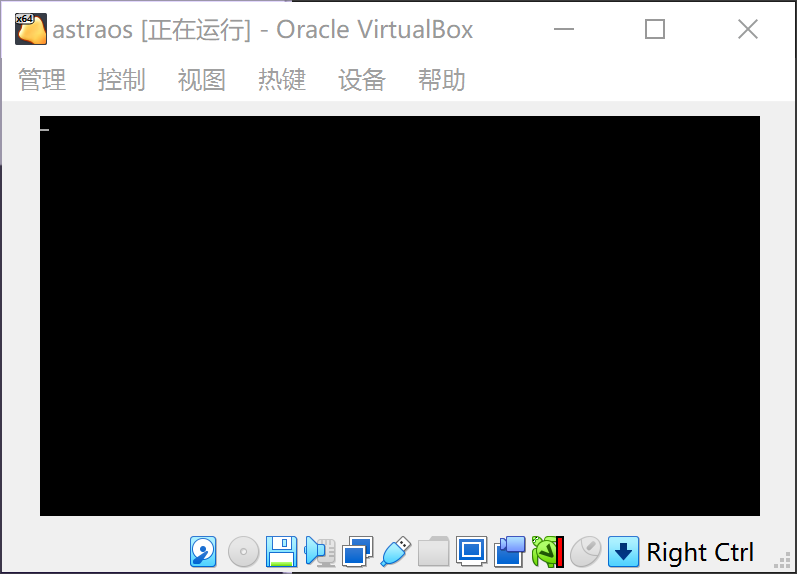

##  工具

首先，需要的工具软件列表：

- wsl + ubuntu：

- nasm编译器：https://www.nasm.us/

- vitualbox：https://www.virtualbox.org/

所需工具

> 操作系统：Linux : Ubuntu18:http://releases.ubuntu.com/18.04/
>
> 汇编编译器：nasm: https://www.nasm.us/
>
> 文本编辑器：vscode: https://code.visualstudio.com/ 
>
> vscode插件：x86 and x86_64 Assembly
> vscode插件：hexdump


## 计算机启动过程

### 1 计算机启动过程

**1.1 加电自检**

计算器通电后，首先加载执行BIOS代码，由BIOS对系统硬件执行自检查。

> 通常完整的POST自检将包括对CPU，640K基本内存，1M以上的扩展内存，ROM，主板，CMOS存储器，串并口，显示卡，软硬盘子系统及键盘进行测试，一旦在自检中发现问题，系统将给出提示信息或鸣笛警告。

BIOS检测硬件是否正常，然后开始初始化一些硬件设备。


**1.2 加载引导扇区**

1. 首先BIOS查找启动盘顺序。BIOS检查到硬件正常并与CMOS中的设置相符后，按照CMOS中对启动设备的设置顺序检测可用的启动设备。

2. BIOS将相应MBR扇区（也就是启动设备的第一个扇区，为硬盘的0面0磁道1扇区，扇区大小为512字节）读入内存地址为0000:7C00H处。

3. BIOS检查扇区格式，判断扇区是否以0xAA55结束，BIOS认为这个扇区是一个可用的引导扇区。否则去尝试其他的启动设备。如果没有启动设备满足要求则显示"NO ROM BASIC"然后死机。


**1.3 执行指令**

加载完成后，BIOS将控制权交给CPU，CPU开始执行0x0000:7c00处，也就是被加载了引导扇区的地方的代码。

cpu加载内核文件，启动相关操作系统。


### 2 BIOS

**2.1 BIOS的作用**

BIOS的英文全称为`Basic Input Output System`，是位于计算机主板上只读ROM芯片上的程序。

BIOS映射的地址为ROM的0xF0000~0xFFFFF位置。

其中`0x00000~0x9FFFF`位置是属于内存条的地址，`0xF0000~0xFFFF`是属于BIOS的ROM地址。


# 主引导扇区

[TOC]

### 1.安装WSl和ubuntu


### 2. 安装nasm编译器

ubuntu下使用命令安装

> sudo apt-get install nasm

### 3. 安装vitualbox

直接下载deb包并安装即可，最新版本是vitualbox 6.1


## 主引导扇区

主引导扇区又称为MBR，是操作系统的起点，当计算机启动后，会加载并执行位于硬盘上的第一个扇区做为引导扇区。


**1. 主引导扇区格式**

- 主引导扇区必须位于硬盘开始位置的512字节。

  > 例如在1.44M软盘上，位于(柱面=0,磁头=0,扇区1)的位置


- 主引导扇区大小必须是512字节。

- 主引导扇区必须是以 `0x55, 0xAA` 为结尾的。


**2. 主引导扇区执行过程**

主引导扇区由BIOS进行加载并执行。

BIOS系统首先会读取 0 柱面 0 磁道 1 扇区，将其内容加载到内存地址的 `0x0000:0x7c00`处。然后BIOS跳转到内存的`0x7c00`处开始执行指令。

至于为什么必须加载到 `0x7c00 `的地方，当时就这么规定的吧，没啥特殊的地方，计算机读取指令开始时，会从 `0x7c00`处读取。（其实还是有点特殊的地方，参见http://www.ruanyifeng.com/blog/2015/09/0x7c00.html）


### 编写一个主引导扇区

下面我们编写一个最简单的主引导扇区，并且在虚拟机中加载运行。


**示例代码**

创建boot目录，并新建文件boot/boot.asm

```assembly
; astraos BOOT
[bits 16]

    org     0x7c00      ; 指明程序的偏移的基地址

    ; 引导扇区代码
    jmp     Entry
    db      0x90
    db      "ASTRABOOT"

; 程序核心内容
Entry:
    jmp $               ; 让CPU挂起，等待指令。

                        ; 扇区格式
Fill0:
    resb    510-($-$$)   ; 当前行$至结束(1FE) 之间的内容填充0
    db      0x55, 0xaa
```

>简单解释下上面的汇编代码：
>
>`org 0x7c00`: 指定一个基地址，用来声明计算程序的偏移地址
>
>`jmp     Entry`：这句是正式开始执行的代码，表示跳转到后面 `Entry`标记的位置执行指令。
>
>`db      0x90,  db      "GLOXBOOT"`:  填充内容，并无实际作用。不是系统指令，也不会被执行。
>
>` jmp $`:  $ 代表当前行首的地址，所以会一直循环执行此指令。
>
>`resb    510-($-$$)`  ： 当前行$至结束(1FE) 之间的内容填充0
>
>`db      0x55, 0xaa`：填充` 0x55, 0xaa`作为主引导扇区结束标识。
>
>

**编译代码**

使用 nasm 编译器编译 boot.asm 文件

> nasm -f bin -o build/boot.bin boot/boot.asm

然后，使用 linux 命令创建一个1.44M大小，字节都为0的 astraos.img 镜像文件

>dd if=/dev/zero of=build/astraos.img bs=512 count=2880

将引导扇区文件，添加到astraos.img 镜像中

> dd if=build/boot.bin  of=build/astraos.img bs=512 count=1  conv=notrunc

创建完成，至于dd命令的用法，自己查找学习，在此不做详述了。

总结，也可以构建完整的 build.sh 执行脚本如下

```nasm
#!/bin/bash

NASM=nasm

mkdir build

$NASM -f bin -o build/boot.bin boot/boot.asm

dd if=/dev/zero of=build/astraos.img bs=512 count=2880

dd if=build/boot.bin  of=build/astraos.img bs=512 count=1  conv=notrunc
```


**在虚拟机中执行**

1. 使用vitualbox虚拟机

   创建一个虚拟电脑，名称为astraos

2. 加载并运行镜像

    使用vitualbox创建一个系统，添加一个软盘驱动器。

    添加一个软盘驱动器。

    使用软盘驱动器加载镜像文件astraos.img。
    
    
    
3. 启动系统
   
	点击显示运行系统
   
    


    顺利启动，可以发现进入一个黑屏界面。并且光标一直闪烁。


    **代码地址**
    [https://github.com/sxt102400/ratsos/tree/master/chapter2.1](https://github.com/sxt102400/ratsos/tree/master/chapter2.1)

### 二进制编码表

英文字符的二进制码（16进制表示）：

| 英文 | 十六进制 | 英文 | 十六进制 | 英文 | 十六进制 | 英文 | 十六进制 |
| ---- | -------- | ---- | -------- | ---- | -------- | ---- | -------- |
| A=65 | 41       | H    | 48       | O    | 4F       | V    | 56       |
| B    | 42       | I    | 49       | P    | 50       | W    | 57       |
| C    | 43       | J    | 4A       | Q    | 51       | X    | 58       |
| D    | 44       | K    | 4B       | R    | 52       | Y    | 59       |
| E    | 45       | L    | 4C       | S    | 53       | Z    | 60       |
| F    | 46       | M    | 4D       | T    | 54       |      |          |
| G    | 47       | N    | 4E       | U    | 55       |      |          |

### 

### 查看二进制文件

以二进制的方式查看astraos文件内容

使用xxd命令分析二进制文件（以16进制方式输出文件的前512字节）

> xxd -l 512 astraos.img

如图：


