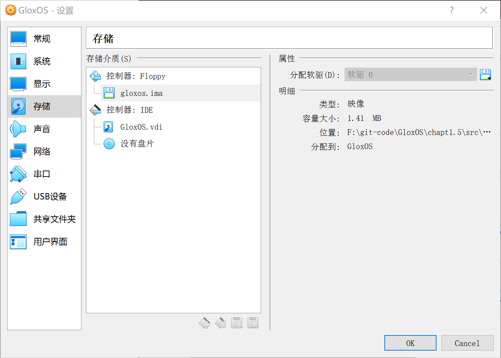
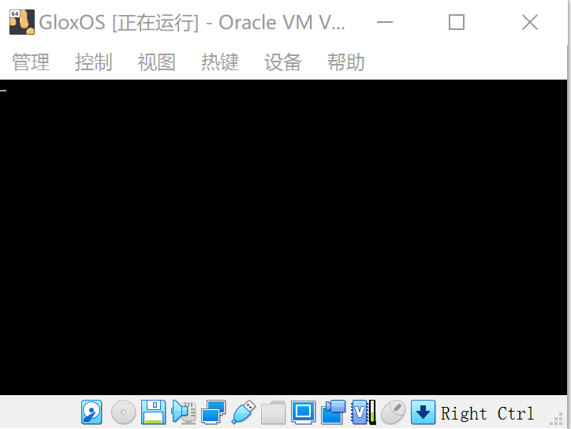

# 主引导扇区

[TOC]

##  工具

首先，需要的工具软件列表：

- ubuntu19：https://ubuntu.com/download

- nasm编译器：https://www.nasm.us/

- vitualbox：https://www.virtualbox.org/


### 1.  安装ubuntu操作系统
由于windows下很多命令行操作有限制，所以编写OS最好是在Linux系统下进行操作，而ubuntu则是一个不错的选择。目前笔者使用的操作系统是ubuntu19.10。当然了，选择直接在PC上安装还是使用虚拟机，看个人选择了。


如果坚持使用wondows开发也不是不可以，就是有些命令需要自己写，或者找工具代替。后面会顺便提供下windows下使用的替代工具，如果想起来的话。


### 2. 安装nasm编译器

ubuntu下使用命令安装

> sudo apt-get install nasm

### 3. 安装vitualbox

直接下载deb包并安装即可，最新版本是vitualbox 6.1


## 主引导扇区

主引导扇区又称为MBR，是操作系统的起点，当计算机启动后，会加载并执行位于硬盘上的第一个扇区做为引导扇区。


**1. 主引导扇区格式**

- 主引导扇区必须位于硬盘开始位置的512字节。

  > 例如在1.44M软盘上，位于(柱面=0,磁头=0,扇区1)的位置


- 主引导扇区大小必须是512字节。

- 主引导扇区必须是以 `0x55, 0xAA` 为结尾的。


**2. 主引导扇区执行过程**

主引导扇区由BIOS进行加载并执行。

BIOS系统首先会读取 0 柱面 0 磁道 1 扇区，将其内容加载到内存地址的 `0x0000:0x7c00`处。然后BIOS跳转到内存的`0x7c00`处开始执行指令。

至于为什么必须加载到 `0x7c00 `的地方，当时就这么规定的吧，没啥特殊的地方，计算机读取指令开始时，会从 `0x7c00`处读取。（其实还是有点特殊的地方，参见http://www.ruanyifeng.com/blog/2015/09/0x7c00.html）


### 编写一个主引导扇区

下面我们编写一个最简单的主引导扇区，并且在虚拟机中加载运行。


**示例代码**

创建boot目录，并新建文件boot/boot.asm

```assembly
; GloxOS BOOT
[bits 16]

    org     0x7c00      ; 指明程序的偏移的基地址

    ; 引导扇区代码
    jmp     Entry
    db      0x90
    db      "GLOXBOOT"

; 程序核心内容
Entry:
    jmp $               ; 让CPU挂起，等待指令。

                        ; 扇区格式
Fill0:
    resb    510-($-$$)   ; 当前行$至结束(1FE) 之间的内容填充0
    db      0x55, 0xaa
```

>简单解释下上面的汇编代码：
>
>`org 0x7c00`: 指定一个基地址，用来声明计算程序的偏移地址
>
>`jmp     Entry`：这句是正式开始执行的代码，表示跳转到后面 `Entry`标记的位置执行指令。
>
>`db      0x90,  db      "GLOXBOOT"`:  填充内容，并无实际作用。不是系统指令，也不会被执行。
>
>` jmp $`:  $ 代表当前行首的地址，所以会一直循环执行此指令。
>
>`resb    510-($-$$)`  ： 当前行$至结束(1FE) 之间的内容填充0
>
>`db      0x55, 0xaa`：填充` 0x55, 0xaa`作为主引导扇区结束标识。
>
>

**编译代码**

使用 nasm 编译器编译 boot.asm 文件

> nasm -f bin -o boot.bin boot/boot.asm

然后，使用 linux 命令创建一个1.44M大小，字节都为0的 gloxos.img 镜像文件

> dd if=/dev/zero of=gloxos.img bs=1024 count=1440

将引导扇区文件，添加到ratsos.img 镜像中

> dd if=boot.bin  of=gloxos.img bs=512 count=1  conv=notrunc

创建完成，至于dd命令的用法，自己查找学习，在此不做详述了。

总结，也可以构建完整的 build.sh 执行脚本如下

```nasm
#!/bin/bash

NASM=nasm
$NASM -f bin -o boot.bin boot/boot.asm
dd if=/dev/zero of=gloxos.img bs=512 count=2880
dd if=boot.bin  of=gloxos.img bs=512 count=1  conv=notrunc
```


**在虚拟机中执行**

1. 使用vitualbox虚拟机

   创建一个虚拟电脑，名称为GloxOS

2. 加载并运行镜像

    使用vitualbox创建一个系统，添加一个软盘驱动器。

    添加一个软盘驱动器。

    使用软盘驱动器加载镜像文件gloxos.img。
    
    
    
3. 启动系统
   
	点击显示运行系统
   
    


    顺利启动，可以发现进入一个黑屏界面。并且光标一直闪烁。


    **代码地址**
    [https://github.com/sxt102400/ratsos/tree/master/chapter2.1](https://github.com/sxt102400/ratsos/tree/master/chapter2.1)

