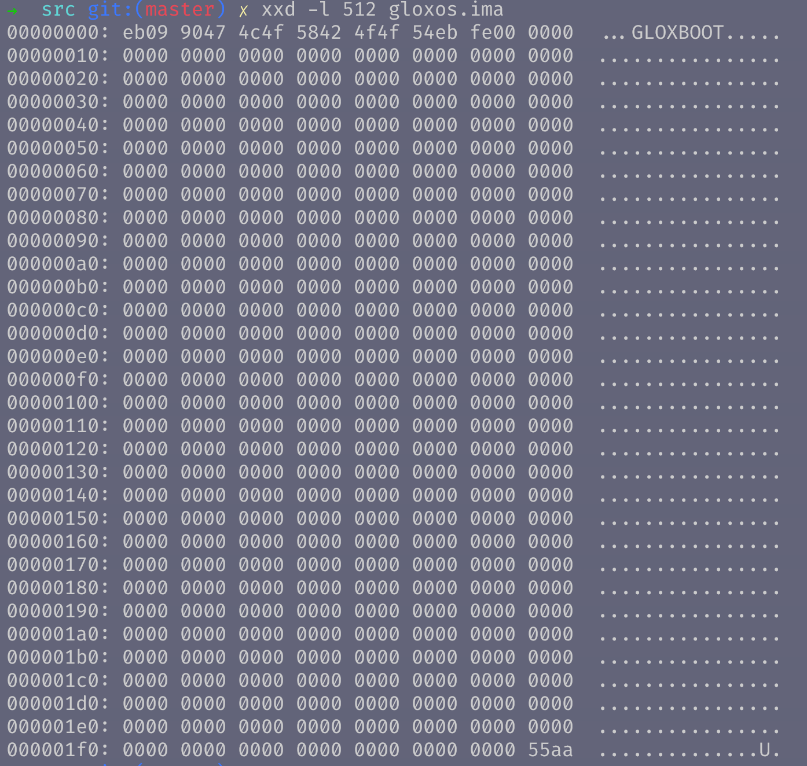

## 二进制文件

[TOC]

###  所需工具

所需工具

> 操作系统：Linux : Ubuntu18:http://releases.ubuntu.com/18.04/
>
> 汇编编译器：nasm: https://www.nasm.us/
>
> 文本编辑器：
>
> - vscode: https://code.visualstudio.com/ 
>- 插件：hexdump for vscode
> - 插件：x86 and x86_64 Assembly
> - 插件：**Beautify** 

### 二进制编码表

英文字符的二进制码（16进制表示）：

| 英文 | 十六进制 | 英文 | 十六进制 | 英文 | 十六进制 | 英文 | 十六进制 |
| ---- | -------- | ---- | -------- | ---- | -------- | ---- | -------- |
| A=65 | 41       | H    | 48       | O    | 4F       | V    | 56       |
| B    | 42       | I    | 49       | P    | 50       | W    | 57       |
| C    | 43       | J    | 4A       | Q    | 51       | X    | 58       |
| D    | 44       | K    | 4B       | R    | 52       | Y    | 59       |
| E    | 45       | L    | 4C       | S    | 53       | Z    | 60       |
| F    | 46       | M    | 4D       | T    | 54       |      |          |
| G    | 47       | N    | 4E       | U    | 55       |      |          |

### 

### 查看二进制文件

以二进制的方式查看GloxOS文件内容

使用xxd命令分析二进制文件（以16进制方式输出文件的前512字节）

> xxd -l 512 gloxos.img

如图：

