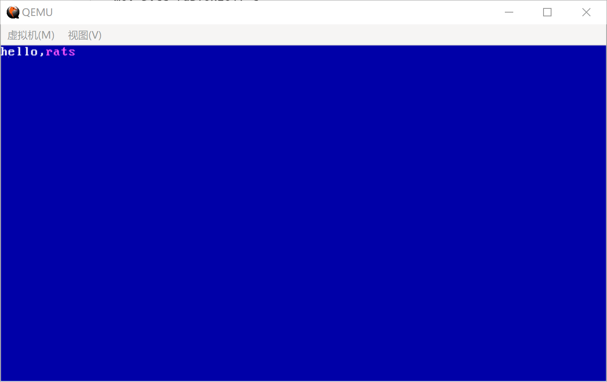

#  文本显示模式

[TOC]


### 显示模式

计算机在加电自检之后，会将显示初始化为80 x 25的文本模式。此时，我们可以进行文本显示了。


而计算机的显示一般有2种模式，可以通过中断来修改显示模式

- 文本模式
- 图形模式

文本模式只能显示字符，一般通过BIOS中断修改。不过首先我们尝试修改显存的方式来显示字符。


而计算机的显示一般有2种模式：

* 文本模式：开始地址地址：0xB8000
* 图形模式:  开始地址地址：0xA0000

图形模式，存储的内容主要是颜色信息，而文字模式，存储的内容主要是文字信息。

比如，刚启动linux时，输出的一堆的启动信息就是，进入文本模式。而开启xwindows才会进入图形模式。

根据分辨率，可用的显示模式如下所列：


### 文本显示模式

**2. 80 x 25文本模式**

刚开始启动计算机时，系统默认进入文本模式。在计算机在加电自检完成之后，会默认将显示初始化为80 x 25的文本模式

在 80 x 25的文本模式，屏幕可以显示25行80列。显示地址段是位于0xB8000-oxBffff的地址段。

我们可以通过修改0xB8000-oxBffff地址段的值，来在屏幕上显示文本。

此模式下每2个内存地址为一组，32位代表一个文字输出： 高地址16位为颜色信息，低地址16位为文字信息

因此我们可以通过修改这段显示地址区域的值，从而来控制屏幕输出文字。


例如：80x25文本模式的颜色如下：

在 80 x 25的文本模式，显存地址是位于0xB8000-oxBffff。

背景色颜色（背景），4位分别为 KRGB，K为是否闪烁
|值|颜色|值|颜色|
|---|---|---|---|
|0|黑色|4|红色|
|1|蓝色|5|紫色|
|2|绿色|6|黄色|
|3|青色|7|白色|


前景色颜色（文字），4位，分别为 IRGB

|值|颜色|值|颜色|
|---|---|---|---|
|0|黑色|8|灰色|
|1|蓝色|9|淡蓝色|
|2|绿色|A|淡绿色|
|3|青色|B | 淡青色|
|4|红色|C | 淡红色|
|5|紫色|D |淡紫色|
|6|黄色|E | 淡黄色|
|7|白色|F | 亮白色|


## 显示字符

**1. 通过修改内存数据来显示字符**

启动后实模式下-文本模式下的初始显存地址范围为[0xB8000-0xBFFFFF]。

显存地址的值对应屏幕的显示数据，我们可以修改显存值来改变屏幕显示。

我们使用段和偏移来表示这段显存信息，段基本地址为0xB800，偏移为0x0000到0xFFFF。

代码如下：


```assembly
mov ax,0xb800
mov ds,ax                ;配置显存段地址
mov byte [0x00],'r'      ;输出字符，内存地址为 DS<<4 + 0x00
mov byte [0x01],0x17     ;设置颜色(背景色蓝，前景色白)
```


### 字符中断显示字符串


**1. 字符中断** 

当BIOS执行显示字符调用显示服务 INT 10H，AH＝0EH，可以进行单个字符的显示


首先需要配置入口参数：


中断号：INT10

|寄存器|说明|值|
|---|---|---|
|AH|功能：在Teletype模式下显示字符|0EH|
|AL|字符|---|
|BH|页码|---|
|BL|前景色(图形模式)|---|

例如:

```assembly
mov ah,0x0e				;BIOS中断参数：显示一个文字
mov byte al,'A'
mov bl,0x03				;BIOS中断参数：指定字符颜色
int 0x10				;调用BIOS中断操作显卡。输出字符
```

**2. 显示一个字符** 


```assembly
;------------------
;显示一个字符，si = 字符串文本地址
.putChar:
    mov al,[si]				;将[di]指向的内存单元的一个字节放入AL。
    inc si					;di指向下一个字节
    cmp al,0				;判断[di]中的字符值是否==0

    je .putEnd			    ;为0字符则串结束
    mov ah,0x0e				;BIOS中断参数：中断模式
    mov bl,0x03				;BIOS中断参数：指定字符颜色
    int 0x10				;调用BIOS中断操作显卡。输出字符
```


**3.循环调用，显示字符串** 


通过中断来显示一个字符，我们可以通过循环操作字符中断的方式，来显示多个字符。

显示字符串代码

```assembly
; ------------------------------------------------------------------------
; 显示字串函数:PrintString
; 参数:
; si = 字符串文本地址
; ------------------------------------------------------------------------
PrintString:
    ; ------------------
    ; 显示一个字符，si = 字符串文本地址
    .putChar:
        mov al,[si]    ; 将[di]指向的内存单元的一个字节放入AL。
        inc si         ; di指向下一个字节
        cmp al,0       ; 判断[di]中的字符值是否==0

        je .putEnd     ; 为0字符则串结束
        mov ah,0x0e    ; BIOS中断参数：中断模式
        mov bl,0x03    ; BIOS中断参数：指定字符颜色
        int 0x10       ; 调用BIOS中断操作显卡。输出字符
        jmp .putChar
   .putEnd:
        ret
```


**4. 代码**

这一段的代码如下：
boot.asm
```assembly
; ASTRAOS BOOT
[bits 16]

org     0x7c00         ; 指明程序的偏移的基地址

jmp     Entry          ; 跳转到程序入口
db 		0x90
db      "ASTRAOS"

; ----------------------------
; 程序入口
; ----------------------------
Entry:

    ; ---------------------------
    ; 清除屏幕
    ; ---------------------------
    mov ah,0x06
    mov bh,0x07
    mov al,0
    mov cx,0
    mov dx,0xffff
    mov bh,0x17        ; 属性为蓝底白字
    int 0x10

    ; ---------------------------
    ; 光标位置初始化
    ; ---------------------------
    mov ah,0x02
    mov bh,0
    mov dx,0
    int 0x10

    ; ---------------------------
    ; 输出字符串
    ; ---------------------------
    mov  si,HelloMsg   ; 将HelloMsg的地址放入si
    call PrintString   ; 调用函数

    jmp $              ; 进入死循环，不再往下执行。
    

; ------------------------------------------------------------------------
; 字符串常量
; ------------------------------------------------------------------------
HelloMsg: db "Hello,AstraOS!",0


; ------------------------------------------------------------------------
; 显示字串函数:PrintString
; 参数:
; si = 字符串文本地址
; ------------------------------------------------------------------------
PrintString:
    ; ------------------
    ; 显示一个字符，si = 字符串文本地址
    .putChar:
        mov al,[si]    ; 将[di]指向的内存单元的一个字节放入AL。
        inc si         ; di指向下一个字节
        cmp al,0       ; 判断[di]中的字符值是否==0

        je .putEnd     ; 为0字符则串结束
        mov ah,0x0e    ; BIOS中断参数：中断模式
        mov bl,0x03    ; BIOS中断参数：指定字符颜色
        int 0x10       ; 调用BIOS中断操作显卡。输出字符
        jmp .putChar
   .putEnd:
        ret

FillSector:
    resb    510-($-$$) ; 处理当前行$至结束(1FE)的填充
    db      0x55, 0xaa
```


**运行**

创建build.sh脚本

```shell
#!/bin/bash

NASM=nasm
mkdir build
$NASM -f bin -o build/boot.bin boot/boot.asm
dd if=/dev/zero of=build/astraos.img bs=512 count=2880
dd if=build/boot.bin  of=build/astraos.img bs=512 count=1  conv=notrunc
```

创建run.sh脚本

```shell
#!/bin/bash

QEMU=qemu-system-x86_64
$QEMU -m 128 -rtc base=localtime -fda build/astraos.img
```

创建run.bat
```
set qume="C:/Program Files/qemu/qemu-system-x86_64w.exe"
%qume% -m 128 -rtc base=localtime -fda build/astraos.img
```

结果如图



