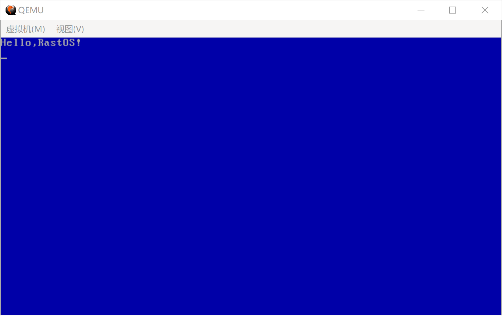

## 显示字符串

### 字符串中断

上面一篇通过循环调用字符中断显示字符串，这次通过AH＝13H字符串中断来显示字符串。


**1. 字符串中断** 

当BIOS执行显示字符串调用显示服务 INT 10H，AH＝13H，可以进行单个字符的显示


首先需要配置入口参数：


中断号：INT10

| 寄存器 | 说明                           | 值   |
| ------ | ------------------------------ | ---- |
| AH     | 功能：在Teletype模式下显示字符 | 13H  |
| AL     | 显示输出方式 | ---- |
| BH     | 页码                           | ---  |
| BL     | 属性，背景色和文字颜色         | ---  |
| CX     | 字符串长度         | ---  |
| DH, DL    | 坐标(行,列)         | ---  |
| ES, BP    | 字符串的地址        | ---  |

AL＝显示输出方式

> 0--字符串中只含显示字符，其显示属性在BL中。显示后，光标位置不变
>
> 1--字符串中只含显示字符，其显示属性在BL中。显示后，光标位置改变
>
> 2--字符串中含显示字符和显示属性。显示后，光标位置不变
>
> 3--字符串中含显示字符和显示属性。显示后，光标位置改变


###  显示字符串函数

我们设置字符串遇到0表示结束，然后将读取的内容调用BIOS中断进行显示。

此处使用汇编定义了一个显示字符串的函数。然后进行调用。

函数如下：

```assembly
; ------------------------------------------------------------------------
; 显示字符串函数:PrintString
; 参数:
; si = 字符串开始地址,
; dh = 第N行，0开始
; dl = 第N列，0开始
; ------------------------------------------------------------------------
PrintString:
			mov cx,0			;BIOS中断参数：显示字符串长度
			mov bx,si
	.s1:;获取字符串长度
			mov al,[bx]			;读取1个字节到al
			add bx,1			;读取下个字节
			cmp al,0			;是否以0结束
			je .s2
			add	cx,1			;计数器
			jmp .s1
	.s2:;显示字符串
			mov bx,si
			mov bp,bx
			mov ax,ds
			mov es,ax			;BIOS中断参数：计算[ES:BP]为显示字符串开始地址

			mov ah,0x13			;BIOS中断参数：显示文字串
			mov al,0x01			;BIOS中断参数：文本输出方式(40×25 16色 文本)
			mov bh,0x0			;BIOS中断参数：指定分页为0
			mov bl,0x1F			;BIOS中断参数：指定白色文字			
			mov dl,0			;列号为0
			int 0x10			;调用BIOS中断操作显卡。输出字符串
			ret
```

### 程序代码

内容如下

```assembly
; ASTRAOS BOOT
[bits 16]

org     0x7c00           ; 指明程序的偏移的基地址

                         ; 引导扇区代码
jmp     Entry
db      0x90
db      "ASTRABOOT"       ; 启动区的名称可以是任意的字符串（8字节）

                         ; 程序核心内容
Entry:

    ; ---------------------------
    ; 清除屏幕
     ; ---------------------------
    mov ah,0x06
    mov al,0
    mov cx,0
    mov dx,0xffff
    mov bh,0x17          ; 属性为蓝底白字
    int 0x10

    ; ---------------------------
    ; 光标位置初始化
     ; ---------------------------
    mov ah,0x02
    mov dx,0
    mov bh,0
    mov dh,0x0
    mov dl,0x0
    int 0x10

    ; ---------------------------
    ; 输出字符串
    ; ---------------------------
    mov si,HelloMsg      ; 将HelloMsg的地址放入si
    mov dh,0             ; 设置显示行
    mov dl,0             ; 设置显示列
    call PrintString     ; 调用函数

    jmp $                ; 进入死循环


; ------------------------------------------------------------------------
; 字符串常量
; ------------------------------------------------------------------------
HelloMsg: db "Hello,ASTRAOS!",0

; ------------------------------------------------------------------------
; 显示字符串函数:PrintString
; 参数:
; si = 字符串开始地址,
; dh = 第N行，0开始
; dl = 第N列，0开始
; ------------------------------------------------------------------------
PrintString:
            mov cx,0     ; BIOS中断参数：显示字符串长度
            mov bx,si
    .s1:                 ; 获取字符串长度
            mov al,[bx]  ; 读取1个字节到al
            add bx,1     ; 读取下个字节
            cmp al,0     ; 是否以0结束
            je .s2
            inc	cx       ; 计数器
            jmp .s1
    .s2:                 ; 显示字符串
            mov bx,si
            mov bp,bx
            mov ax,ds
            mov es,ax    ; BIOS中断参数：计算[ES:BP]为显示字符串开始地址

            mov ah,0x13  ; BIOS中断参数：中断模式
            mov al,0x01  ; BIOS中断参数：输出方式
            mov bh,0x0   ; BIOS中断参数：指定分页为0
            mov bl,0x1F  ; BIOS中断参数：显示属性，指定白色文字
            int 0x10     ; 调用BIOS中断操作显卡。输出字符串
            ret


FillSector:
    resb    510-($-$$)   ; 处理当前行$至结束(1FE)的填充
    db      0x55, 0xaa
```


结果如图




