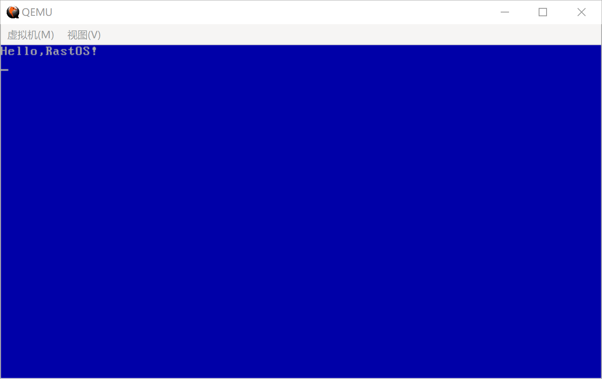

### 显示字符串: 使用字符中断


**1. 字符中断** 

当BIOS执行显示字符调用显示服务 INT 10H，AH＝0EH，可以进行单个字符的显示


首先需要配置入口参数：


中断号：INT10

| 寄存器 | 说明                  | 值   |
| --- | ------------------- | --- |
| AH  | 功能：在Teletype模式下显示字符 | 0EH |
| AL  | 字符                  | --- |
| BH  | 页码                  | --- |
| BL  | 前景色(图形模式)           | --- |

例如:

```assembly
mov ah,0x0e				;BIOS中断参数：显示一个文字
mov byte al,'A'
mov bl,0x03				;BIOS中断参数：指定字符颜色
int 0x10				;调用BIOS中断操作显卡。输出字符
```

**2. 显示一个字符** 


```assembly
;------------------
;显示一个字符，si = 字符串文本地址
.putChar:
    mov al,[si]				;将[di]指向的内存单元的一个字节放入AL。
    inc si					;di指向下一个字节
    cmp al,0				;判断[di]中的字符值是否==0

    je .putEnd			    ;为0字符则串结束
    mov ah,0x0e				;BIOS中断参数：中断模式
    mov bl,0x03				;BIOS中断参数：指定字符颜色
    int 0x10				;调用BIOS中断操作显卡。输出字符
```


**3.循环调用，显示字符串** 

通过中断来显示一个字符，我们可以通过循环操作字符中断的方式，来显示多个字符。

显示字符串代码

```assembly
; ------------------------------------------------------------------------
; 显示字串函数:PrintString
; 参数:
; si = 字符串文本地址
; ------------------------------------------------------------------------
PrintString:
    ; ------------------
    ; 显示一个字符，si = 字符串文本地址
    .putChar:
        mov al,[si]    ; 将[di]指向的内存单元的一个字节放入AL。
        inc si         ; di指向下一个字节
        cmp al,0       ; 判断[di]中的字符值是否==0

        je .putEnd     ; 为0字符则串结束
        mov ah,0x0e    ; BIOS中断参数：中断模式
        mov bl,0x03    ; BIOS中断参数：指定字符颜色
        int 0x10       ; 调用BIOS中断操作显卡。输出字符
        jmp .putChar
   .putEnd:
        ret
```


**4. 代码**

这一段的代码如下：
boot.asm
```assembly
; RASTOS BOOT
[bits 16]

org     0x7c00         ; 指明程序的偏移的基地址

jmp     Entry          ; 跳转到程序入口
db 		0x90
db      "RASTBOOT"

; ----------------------------
; 程序入口
; ----------------------------
Entry:

    ; ---------------------------
    ; 清除屏幕
    ; ----------------------------
    mov ah,0x06
    mov bh,0x07
    mov al,0
    mov cx,0
    mov dx,0xffff
    mov bh,0x17        ; 属性为蓝底白字
    int 0x10

    ; ---------------------------
    ; 光标位置初始化
    ; ----------------------------
    mov ah,0x02
    mov bh,0
    mov dx,0
    int 0x10

    ; ---------------------------
    ; 输出字符串
    ; ---------------------------
    mov  si,HelloMsg   ; 将HelloMsg的地址放入si
    call PutString   ; 调用函数

    jmp $              ; 进入死循环，不再往下执行。
    

; ------------------------------------------------------------------------
; 字符串常量
; ------------------------------------------------------------------------
HelloMsg: db "Hello,RastOS!",0


; ------------------------------------------------------------------------
; 显示字串函数:PrintString
; 参数:
; si = 字符串文本地址
; ------------------------------------------------------------------------
PutString:
    ; ------------------
    ; 显示一个字符，si = 字符串文本地址
    .putChar:
        mov al,[si]    ; 将[di]指向的内存单元的一个字节放入AL。
        inc si         ; di指向下一个字节
        cmp al,0       ; 判断[di]中的字符值是否==0

        je .putCRLF    ; 为0字符则串结束
        mov ah,0x0e    ; BIOS中断参数：中断模式
        mov bl,0x03    ; BIOS中断参数：指定字符颜色
        int 0x10       ; 调用BIOS中断操作显卡。输出字符
        jmp .putChar
    .putCRLF:
        mov al,13      ; 回车
        mov ah,0x0e    ; BIOS中断参数：中断模式
        mov bl,0x03    ; BIOS中断参数：指定字符颜色
        int 0x10       ; 调用BIOS中断操作显卡。输出字符

        mov al,10      ; 换行
        mov ah,0x0e    ; BIOS中断参数：中断模式
        mov bl,0x03    ; BIOS中断参数：指定字符颜色
        int 0x10       ; 调用BIOS中断操作显卡。输出字符
        jmp .putEnd
    .putEnd:
        ret

FillSector:
    resb    510-($-$$) ; 处理当前行$至结束(1FE)的填充
    db      0x55, 0xaa
```


**运行**

创建build.sh脚本

```shell
#!/bin/bash

NASM=nasm
mkdir build
$NASM -f bin -o build/boot.bin boot/boot.asm
dd if=/dev/zero of=build/astraos.img bs=512 count=2880
dd if=build/boot.bin  of=build/astraos.img bs=512 count=1  conv=notrunc
```

创建run.sh脚本

```shell
#!/bin/bash

QEMU=qemu-system-x86_64
$QEMU -m 128 -rtc base=localtime -fda build/astraos.img
```

创建run.bat
```
set qume="C:/Program Files/qemu/qemu-system-x86_64w.exe"
%qume% -m 128 -rtc base=localtime -fda build/astraos.img
```

结果如图




