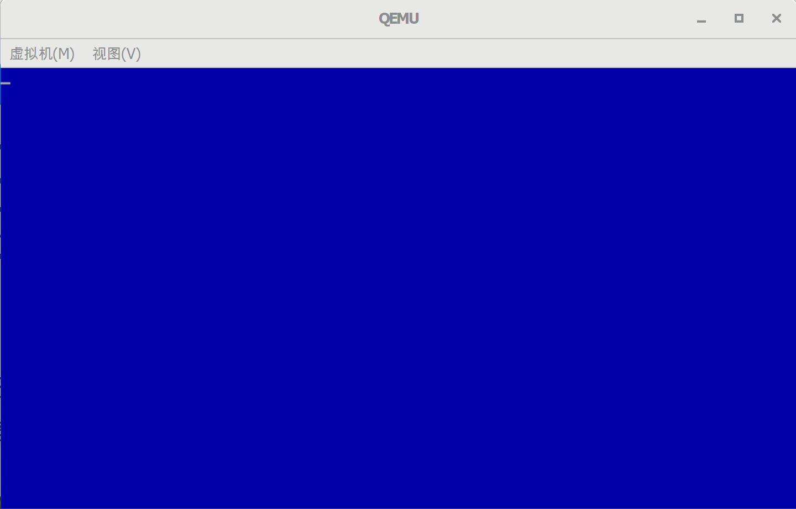

## 清屏

[TOC]


### 需要的工具

> qemu: [qemu](https://www.qemu.org/)
>
> (windows版本：https://qemu.weilnetz.de/w64/2021/)


### BIOS中断清屏

清屏是通过BIOS中断，来滚动屏幕，达到清屏的效果。

**1. BIOS中断滚屏**

中断 int 10h，AH = 06H / 07H

| 寄存器 | 说明                             | 值                            |
| ------ | -------------------------------- | ----------------------------- |
| AH     | 功能编码                         | 向上滚屏：06H，向下滚屏 : 07H |
| BH     | 空白区域的缺省属性               |                               |
| AL     | 滚动行数                         | 0：清窗口                     |
| CH、CL | 滚动区域左上角位置：Y坐标，X坐标 |                               |
| DH、DL | 滚动区域右下角位置：Y坐标，X坐标 |                               |


例如：使用蓝底白字清屏

```assembly
;---------------------------
;清除屏幕	 
mov ah,0x06								
mov al,0
mov cx,0   
mov df,0xffff  
mov bh,0x17				;属性为蓝底白字
int 0x10
```


**2. BIOS中断设置光标位置：**

中断 int 10h

功能描述：用文本坐标下设置光标位置

入口参数：

| 寄存器 | 说明                  | 值                |
| ------ | --------------------- | ----------------- |
| AH     | 功能编码              | 设置光标位置：02H |
| BH     | 显示页码              |                   |
| DH，DL | 行，列 (Y坐标，X坐标) |                   |

例如：设置光标到第一行第一列

```assembly
    ;---------------------------			
    ;光标位置初始化
    mov ah,0x02				
    mov bh,0
    mov dx,0
    int 0x10
```


### 实现

**1. 代码**


boot.asm内容如下

```assembly
; GloxOS BOOT
[bits 16]

org     0x7c00         ; 指明程序的偏移的基地址

jmp     Entry          ; 跳转到程序入口
db 		0x90
db      "GLOXBOOT"

; ----------------------------
; 程序入口
; ----------------------------
Entry:

    ; ---------------------------
    ; 清除屏幕
    ; ----------------------------
    mov ah,0x06
    mov bh,0x07
    mov al,0
    mov cx,0
    mov dx,0xffff
    mov bh,0x17        ; 属性为蓝底白字
    int 0x10

    ; ---------------------------
    ; 光标位置初始化
    ; ----------------------------
    mov ah,0x02
    mov bh,0
    mov dx,0
    int 0x10

Fin:
    hlt
    jmp Fin            ; 进入死循环，不再往下执行。

Fill_Sector:
    resb    510-($-$$)      ; 处理当前行$至结束(1FE)的填充
    db      0x55, 0xaa
```


### 创建build.sh脚本

```shell
#!/bin/bash

NASM=nasm
$NASM -f bin -o build/boot.bin boot/boot.asm
dd if=/dev/zero of=build/gloxos.img bs=512 count=2880
dd if=build/boot.bin  of=build/gloxos.img bs=512 count=1  conv=notrunc
```

编译成gloxos.ima镜像文件。


**运行**


创建run.sh脚本

```
#!/bin/bash

QEMU=qemu-system-x86_64
$QEMU -m 128 -rtc base=localtime -fda build/gloxos.img
```


执行run.sh脚本

结果如图




**代码地址**

[https://github.com/sxt102400/ratsos/tree/master/chapter2.4](https://github.com/sxt102400/ratsos/tree/master/chapter2.4)