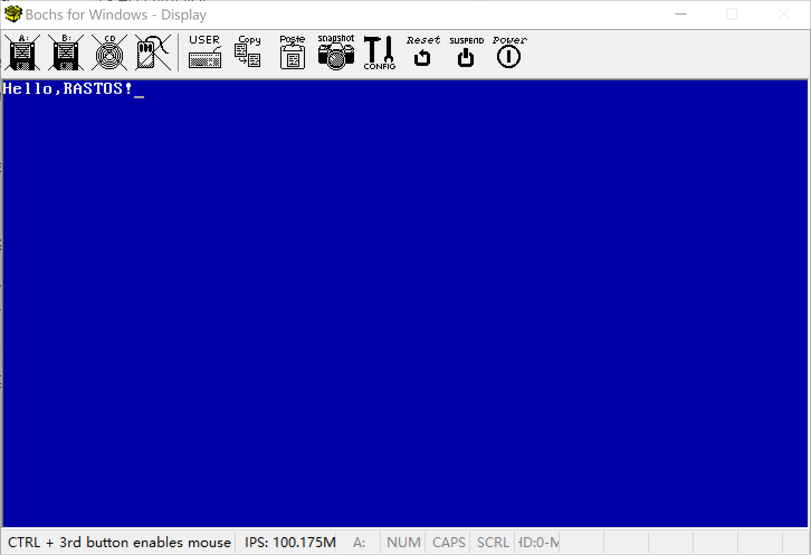

## Bochs


### 工具

> bochs:  [bochs](http://bochs.sourceforge.net/)
>


### ubuntu安装配置Bochs

1. 安装bochs


2. 创建工程目录

创建工程目录并进入

1. 新建并修改配置文件

在工程目录下新建bochsrc.me文件

> $ vim bochsrc.me

```
cpu: model=core2_penryn_t9600, count=1, ips=50000000, reset_on_triple_fault=1, ignore_bad_msrs=1, msrs="msrs.def"
cpu: cpuid_limit_winnt=0

memory: guest=512, host=256


romimage: file=$BXSHARE/BIOS-bochs-latest, options=fastboot

vgaromimage: file=$BXSHARE/VGABIOS-lgpl-latest


mouse: enabled=0

pci: enabled=1, chipset=i440fx

private_colormap: enabled=0


floppya: 1_44=/dev/fd0, status=inserted


ata0: enabled=1, ioaddr1=0x1f0, ioaddr2=0x3f0, irq=14
ata1: enabled=1, ioaddr1=0x170, ioaddr2=0x370, irq=15
ata2: enabled=0, ioaddr1=0x1e8, ioaddr2=0x3e0, irq=11
ata3: enabled=0, ioaddr1=0x168, ioaddr2=0x360, irq=9


ata0-master: type=disk, mode=flat,path="build/rastos.img"


boot: disk

floppy_bootsig_check: disabled=0

log: bochsout.txt


panic: action=ask
error: action=report
info: action=report
debug: action=ignore, pci=report # report BX_DEBUG from module 'pci'


debugger_log: -

parport1: enabled=1, file="parport.out"


sound: driver=default, waveout=/dev/dsp. wavein=, midiout=

speaker: enabled=1, mode=sound, volume=15

```

脚本文件
build.sh
```
#!/bin/bash

NASM=nasm
BOXIMAGE=bximage

mkdir build

$NASM -f bin -o build/boot.bin boot/boot.asm

$BOXIMAGE  -func=create  -imgmode=flat -hd=16M   -q  build/rastos.img 
dd if=/dev/zero of=build/rastos.img bs=512 count=2880
dd if=build/boot.bin of=build/rastos.img bs=512 count=1 conv=notrunc
```
run.bat
```
Rem bat
@echo bochs start
set bochs="C:/Program Files (x86)/Bochs-2.6.9/bochsdbg.exe"
%bochs% -f bochsrc.me
```

### Bochs使用

**1. 运行**

进入工程目录
输入 `bochs`命令运行

进入选择命令行，输入6启动模拟器


**2. 创建硬盘镜像**

>   bximage  -mode=create -hd=128M -imgmode=flat -q icyos.img


**3. 根据配置文件运行**

命令如下：

```
bochs -f bochsrc.me
```


**4. Bochs调试**

| 命令        | 说明                     |
| ----------- | ------------------------ |
| blist       | 显示所有断点信息         |
| pb  [物理地址] | 设置断点，以物理地址方式 |
| vb [虚拟地址] | 设置断点，以虚拟地址方式 |
| lb [线性地址] | 设置断点，以线性地址方式 |
| d [断点号] | 删除断点 ,断点号根据blist查询 |
| c    | 继续执行，跳到下一个断点/      |
| s [N] | 单步执行                   |
| n    | 单步执行(跳过call函数内部 ) |
| q    | 退出                       |

**显示信息**

| 命令            | 说明                         |
| ------------- | -------------------------- |
| show mode     | 显示模式切换                     |
| show int      | 显示中断                       |
| show call     | 显示call调用                   |
| trace on      | 显示指令反编译                    |
| info ivt      | 显示ivt（中断向量表）信息             |
| info idt      | 显示idt（中断描述符表）信息            |
| info gdt      | 显示gdt信息                    |
| info ldt      | 显示ldt信息                    |
| info tss      | 显示tss信息                    |
| info tab      | 页表映射                       |
| reg           | 通用寄存器信息 + 标志寄存器 + eip寄存器信息 |
| sreg          | 段寄存器信息                     |
| creg          | 控制寄存器信息                    |
| dreg          | 调试寄存器信息                    |
| print-stack N | 堆栈信息                       |

**内存信息**

| 命令             | 说明                           |
| -------------- | ---------------------------- |
| xp /nuf [物理地址] | 显示物理地址处内容，例如：xp /100 0xa0000 |
| x /nuf  [线性地址] | 显示线性地址处内容                    |
| setpmem        |                              |
| page           |                              |
|                |                              |


