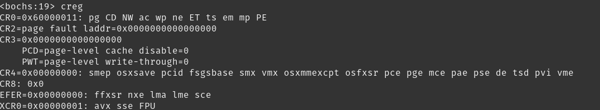

## 保护模式

###  保护模式寻址方式

**1. 实模式下寻址的缺陷**


**2.保护模式下寻址**

实模式下使用的是`段寄存器(16位) << 4 + 偏移地址`方式来寻址。

保护模式可就厉害了，寻址方式是另外的方式，和实模式下的完全不一样。

1. 保护模式下寻址方式

   1）首先内存中建立一个GDT全局分段描述表。

   2）DS中不再是内存的段开始地址，而是GDT表的索引。

   3）寻址时，首先根据DS的高13位的值得到一个索引，然后查找到在GDT中对应的一个全局分段描述。再根据这个描述来定位到段的开始位置。

   4）找到GDT段之后，继续根据偏移地址，在GDT段内进行内存寻址。

2. 段的跳转指令

   JMP 段选择子:偏移地址

1）加载段选择子到CS段寄存器
2）获取段选择子索引号，根据索引号查找GDT表，加载GDT段描述符到CS段寄存器的描述符缓存
3）加载偏移地址到EIP寄存器
4）根据 CS段寄存器的描述符缓存 和 EIP寄存器 寻址。

最后跳转位置是

  内存地址：段基本地址(根据段选择子获取) + 偏移地址


**保护模式下的段**

1. 段选择器

保护模式下，段寄存器CS，DS,ES,，FS，GS,SS，称之为段选择器。

段选择器中的数据称为段选择子

  段选择子 ： 描述符索引(13位) | TI | RPL

其中

- 描述符索引：GDT描述符表中的描述符的索引号(从0开始：0,1,2,3...)
- TI： TI = 0 表示GDT描述符， TI =1 表示LDT描述符
- RPL： 请求权特级：

当我们跳转到段的时侯，实际上是段选择器赋值为以上格式的值即可。


### 实模式和保护模式的区别


在计算机加载完成后，在实模式执行完一些初始化和加载工作。然后CPU设置进入保护模式。可以使用16位的数据。。

为了突破实模式1M内存寻址的限制，使用到更多内存。于是出现了保护模式，保护模式下，通过开启A20总线，可以使用32位的寄存器操作，其实访问地址已经达到了1<<32=4G内存。

实模式与保护模式的最大区别就是寻址方式:

实际上保护模式不再使用`段寄存器 <<4 ＋偏移地址`的方式寻址，通过建立分段表将内存分成段。寻址时先加载分段表进入不同的段位置，然后在当前段内继续进行内存寻址。


## 进入保护模式

[TOC]

### 进入保护模式

进入保护模式的步骤：

1. 关闭中断，打开地址线A20GATE，使得CPU可以访问1M以上的内存空间。
2. 设置CR0寄存器，进入保护模式。
3. 加载临时GDT
4. 进入保护模式后，首先执行jmp指令。因为内存寻址方式改变，需要刷新指令流水线


### 打开A20Gate

#### 1. A20Gate的作用

在实模式下，A20Gate是关闭的，意味着只能使用20根地址线，需要通过打开A20Gate,访问第21根以上的总线。

**A20Gate关闭时侯的内存访问：**

在8088 CPU下, 只能使用20根总线 . 

因此,初始化时, A20Gate关闭式，使用20根总线. 所以寻址范围位 0x00000 ~ 0xFFFFF,总共1M的地址范围。

当访问的地址大于这个范围，高位的值将被截取掉，导致超出1M的地址访问会使得CPU回滚到1M内地址范围的现象

> 例如:
>
> 当使用 [0xFFFF :0xFFFF ] 内存地址，得到的地址位 0x10FFEF 。但是在实模式下，由于20根总线的限制，最高位的1是无效的，实际的访问地址`回绕到` [0x0FFEF]。

**A20Gate打开后的内存访问：**


后期,80286使用24根总线,而80286有24根总线,80386有32位总线.

打开A20Gate， 可以使用到32位的地址总线，内存地址访问也达到了1<<32 的4G范围。

实际上开启A20Gate，总线的寻址能力达到了4G，但是cpu的内存访问能力因为16位段寄存器，和16位偏移地址的限制，并不能协调工作。

A20Gate打开后, 还需要进入保护模式, 建立GDT描述名, 进行段地址 和 内存的映射关系, 使用新的内存地址访问方式 . 突破cpu的内存访问限制。


#### 2. 开启A20Gate  

开启A20Gate，只要设置io端口0x92的第一位为1就可以了。

```
;------------------
;打开A20
cli							;禁止CPU级别的中断
in 		al,0x92
or 		al,0000_0010B        	;设置第1位为1
out 	0x92,al
```


### 设置CR0寄存器，进入保护模式

CR0寄存器

CR0寄存器是一个32位的寄存器

设置CR0寄存器的最高位为0，最低位为1，则可以进入保护模式。

CR0寄存器的作用

- 改变段寻址方式，使用段描述符方式寻址。
- 实模式指令的操作数默认为16位，保护模式指令的操作数默认为32位。

代码：

```
;------------------
;进入保护模式
mov 	eax,CR0
or 		eax,0x00000001            ;设置第0位为1
mov 	CR0,eax
```


loader.asm完整代码如下

```assembly
; GloxOS LOADER
;Tab=4
[bits 16]

;----------- loader const ------------------
LOADER_BASE_ADDR 		equ 0x9000  ;内存地址0x9000
;---------------------------------------

section loader vstart=LOADER_BASE_ADDR ;指明程序的偏移的基地址

	jmp Entry
	
	
;程序核心内容
Entry:
	

	;------------------
	;禁止CPU级别的中断
	;------------------
	cli						    

	;------------------
	;打开A20
	;------------------
	in 		al,0x92
	or 		al,0000_0010B       ;设置第1位为1
	out 	0x92,al
	

	;------------------
	;进入保护模式
	;------------------
	mov 	eax,cr0
	or 		eax,0x1      ;设置第0位为1
	mov 	cr0,eax


;程序挂起		
	jmp $			;让CPU挂起，等待指令。

times	512-($-$$) db  0 ; 处理当前行$至结束(1FE)的填充
```


## 刷新流水线

### 为什么需要刷新流水线


进入保护模式下，需要尽快刷新CS，SS等段寄存器。


### 立即跳转到32位模式，刷新流水线


进入保护模式后，需要马上跳转并刷新流水

定义代码段和数据段的选择子常量

>CODE选择子： selector_code =  0x1<<3  + 000B
>
>DATA 选择子：selector_data =  0x2<<3  + 000B
>
>VGA 选择子：  selector_vga =  0x3 <<3  + 000B


boot.inc文件定义选择子

```
;-------------    选择子 --------------------------
SELECTOR_CODE equ 0x1<<3
SELECTOR_DATA equ 0x2<<3
SELECTOR_VGA equ 0x3<<3
```

​            


loader.asm文件 跳转并刷新流水，由16位模式进入32位代码模式：

```assembly
;------------------------    
;刷新流水线，进入32位模式
[bits 16]

     jmp	 dword   SELECTOR_CODE:FlushPipeline       


[bits 32]
;------------------    
;刷新流水线
FlushPipeline:

    mov		ax,SELECTOR_DATA			;  可读写的32bit
    mov		ds,ax
    mov		es,ax
    mov		fs,ax
    mov     ss,ax
    mov     ax,SELECTOR_VGA
    mov     gs,ax

```


## 使用bochs调试

在0x7c00打断点，输入c跳转执行

> *$  pb 0x7c00* 
>
> $ c

输入显示切换模式命令

> $  show mode

输入c继续执行

> $ c

可以看到控制他输出：

> 00017609546: switched from 'real mode' to 'protected mode'

说明系统成功的从实模式切换到保护模式


查看CR0的PE位: 值为1

> $ creg



                               |


