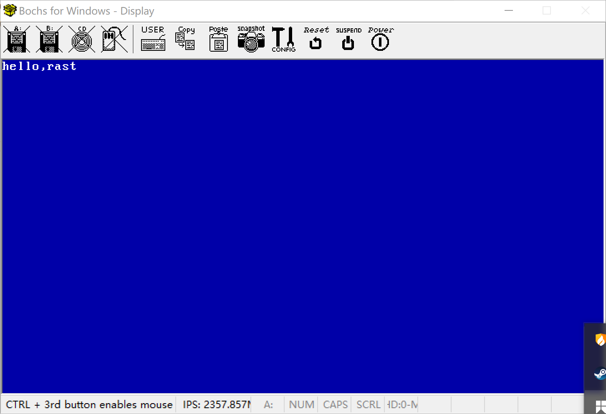

## 为什么需要刷新流水线

实模式和保护模式，地址位数不一样，实模式是16位寻址，保护模式是32位寻址。

实模式和保护模式的寻址方式也不一样，段寄存器内容也不一样。实模式中，CS和DS段寄存器是当前代码或者数据的基址段寄存器。而保护模式下，CS和DS段寄存器是GDT表的索引。


因此，进入保护模式下，需要尽快刷新CS，SS等段寄存器，否则将无法进行寻址。


## 立即跳转到32位模式，刷新流水线


进入保护模式后，需要马上跳转并刷新流水

定义代码段和数据段的选择子常量

>CODE选择子： selector_code =  0x1<<3  + 000B
>
>DATA 选择子：selector_data =  0x2<<3  + 000B
>
>VGA 选择子：  selector_vga =  0x3 <<3  + 000B


boot.inc文件定义选择子

```
;-------------    选择子 --------------------------
SELECTOR_CODE equ 0x1<<3
SELECTOR_DATA equ 0x2<<3
SELECTOR_VGA equ 0x3<<3
```


loader.asm文件 跳转并刷新流水，由16位模式进入32位代码模式：

```assembly
;------------------------    
;刷新流水线，进入32位模式
[bits 16]

     jmp	 dword   SELECTOR_CODE:FlushPipeline       


[bits 32]
;------------------    
;刷新流水线
FlushPipeline:

    mov		ax,SELECTOR_DATA			;  可读写的32bit
    mov		ds,ax
    mov		es,ax
    mov		fs,ax
    mov     ss,ax
    mov     ax,SELECTOR_VGA
    mov     gs,ax

```


### 代码

loader文件内容如下：
loader.asm
```
;RAST LOADER [0x8000]
;Tab=4
[bits 16]

%include "boot/boot.inc"

;---------------------------------------

section loader vstart=LOADER_BASE_ADDR ;指明程序的偏移的基地址

	jmp Entry
	
;---------------------------------
;定义GDT全局描述符表
;code: 0x00000000 - 0x000FFFFF  
;data: 0x00000000 - 0x000FFFFF  
;vga:  0x000B8000 - 0x000BFFFF
;---------------------------------
Gdt_Addr:
    dw		8*4-1						;指定段上限为4(GDT全局描述符表的大小)
    dd		Gdt_Table_Addr				;GDT全局描述符表的地址
Gdt_Table_Addr:
    Gdt_Descriptor 0,0,0
    Gdt_Descriptor 0x00000000, 0x000FFFFF, DESC_ATTR_CODE  ;可以执行的段
    Gdt_Descriptor 0x00000000, 0x000FFFFF, DESC_ATTR_DATA  ;可以读写的段
    Gdt_Descriptor 0x000B8000, 0x00007FFF, DESC_ATTR_DATA  ;vga段
    dw		0	


;程序核心内容
Entry:
	
    ;------------------
	;禁止CPU级别的中断
	;------------------
	cli						    

	;------------------
	;打开A20
	;------------------
	in 		al,0x92
	or 		al,0000_0010B       ;设置第1位为1
	out 	0x92,al

    ;----------------------
    ;加载GDT
    ;----------------------
    lgdt [Gdt_Addr]

	;------------------
	;进入保护模式
	;------------------
	mov 	eax,cr0
	or 		eax,0x1      ;设置第0位为1
	mov 	cr0,eax

	jmp     ProtectMode

;------------------------    
;刷新流水线，进入32位模式
[bits 16]
ProtectMode:
     jmp	 dword   SELECTOR_CODE:FlushPipeline       


[bits 32]
;------------------    
;刷新流水线
FlushPipeline:
    mov		ax,SELECTOR_DATA			;  可读写的32bit
    mov		ds,ax
    mov		es,ax
    mov		fs,ax
    mov     ss,ax
    mov     ax,SELECTOR_VGA
    mov     gs,ax

PutHello:
    ; ---------------------------
    ; 打印hello
    ; ----------------------------
	mov byte [gs:0x00],'h'      ;输出字符
	mov byte [gs:0x01],0x1F     ;设置颜色(背景色蓝，前景色白)
	mov byte [gs:0x02],'e'
	mov byte [gs:0x03],0x1F
	mov byte [gs:0x04],'l'
	mov byte [gs:0x05],0x1F
	mov byte [gs:0x06],'l'
	mov byte [gs:0x07],0x1F
	mov byte [gs:0x08],'o'
	mov byte [gs:0x09],0x1F
	mov byte [gs:0x0a],','     
	mov byte [gs:0x0b],0x1F     
	mov byte [gs:0x0c],'r'		 ;输出字符
	mov byte [gs:0x0d],0x1F		 ;设置颜色(背景色蓝，前景淡紫)
	mov byte [gs:0x0e],'a'
	mov byte [gs:0x0f],0x1F
	mov byte [gs:0x10],'s'
	mov byte [gs:0x11],0x1F
	mov byte [gs:0x12],'t'
	mov byte [gs:0x13],0x1F

;程序挂起
Fin:
    hlt 					;让CPU挂起，等待指令。
    jmp Fin

times	512-($-$$) db  0 ; 处理当前行$至结束(1FE)的填充	
```





