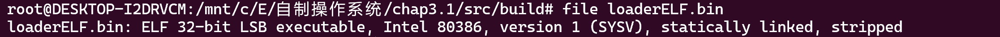
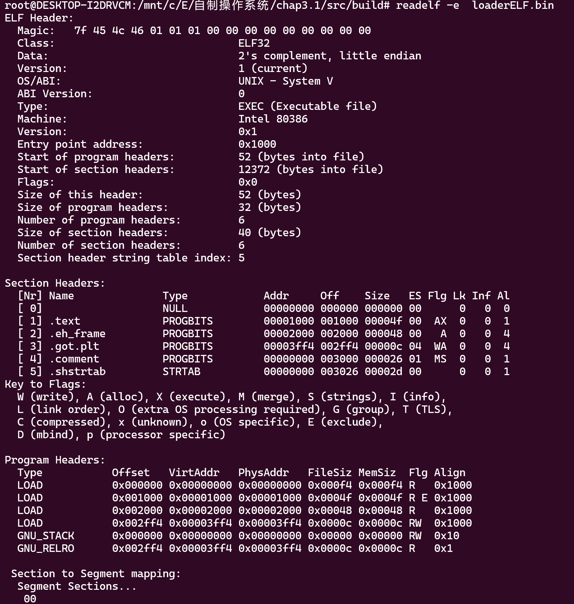
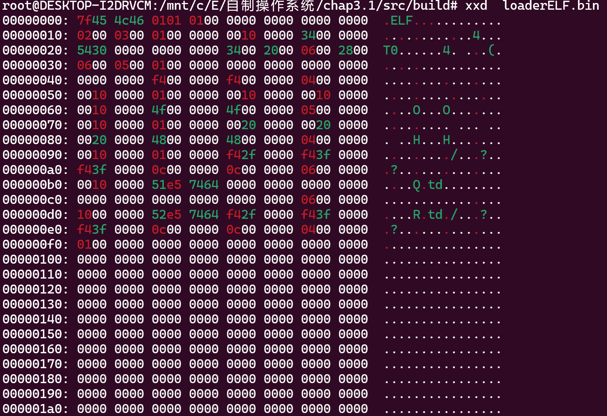

### C语言程序

##  工具

首先，需要的工具软件列表：

- gcc编译器：


### 编译C语言程序


**1. 为什么没有main函数**

main函数链接时需要一些系统库文件。而我们的系统目前并没有任何的系统库可以用，会导致报错。

所以此处不能使用main函数。

那么我们使用默认的入口_start符号(不设置,则默认为0)


### 准备工作

输出当前现存显存显示位置是否为素数的c语言代码

boot/loaderELF.c

```c
int is_prime(unsigned short n)
{
	//返回1表示素数，返回0表示非素数
	int i = 0;
	for (i = 2; i < n; i++)
	{
		if (n % i == 0)
		{
			return 0;
		}
	}
	return 1;
}

int  _start(){
    unsigned short*   pvga = (unsigned short*)0xb8000;	//填充到显示内存的初始地址	
    for(int i = 0;i <= 0x7fff;i++){
         //char: 0x3 ,color: 0x104
        if(is_prime(i) == 1) {
            *(pvga + i) = (unsigned short)0x1704;		 //显存填充，蓝色背景白色棱形
        } else {
            *(pvga + i) = (unsigned short)0x1700;	 //显存填充背景色
        }
    }
    fin:
    	goto fin;
}


```

说明：
1）计算素数数字，左上为0，位置从左到右并逐行增加，和显存的偏移量相同
2）使用简单的循环遍历计算当前位置的数字是否为素数
3）如果位置不为素数，输出空白，为素数输出棱形
3）0x1704: 0x17代表蓝色背景白色文字，0x04在ascii码里面是棱形```

编译成目标文件

> $ gcc  boot/loaderELF.c  -m32 -c   build/loaderELF.o

gcc编译参数

>`-O0`: 无优化。编译器不会进行任何优化，生成的代码与源代码几乎完全相同。
>-nostdinc:  不搜索默认路径头文件
>-nostdlib： 不使用标准库
>-fno-builtin： 不使用内建函数
>-Wall 
>-Wstrict-prototypes
> -Wmissing-prototypes

### 链接C语言程序

**1. 为什么要指定程序入口**
由于在保护模式下，我们默认加载到 0x10000处执行代码。所以，下载需要做的是
1）指定当前c语言程序的入口地址为0x10000
2）复制程序段的执行程序段到 0x10000


链接并指定程序入口

> ld -m elf_i386 -s -Ttext  0x00010000 build/loaderELF.o -o build/loaderELF.bin

最后的bin文件大小大概 是14Kb. 

### ELF信息查看 

查看文件信息

> file loaderELF.bin



查看反编译内容

> objdump -S loaderELF.bin


查看文件信息

> readelf -e  loaderELF.bin



查看纯二进制内容

> xxd loaderELF.bin


