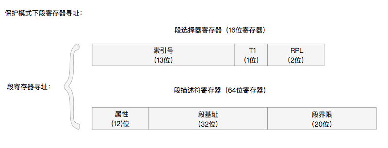

## 保护模式

###  保护模式寻址方式

**1. 实模式下寻址的缺陷**

**2.保护模式下寻址**

实模式下使用的是`段寄存器(16位) << 4 + 偏移地址`方式来寻址。

保护模式可就厉害了，寻址方式是另外的方式，和实模式下的完全不一样。

1. 保护模式下寻址方式

   1）首先内存中建立一个GDT全局分段描述表。

   2）DS中不再是内存的段开始地址，而是GDT表的索引。

   3）寻址时，首先根据DS的高13位的值得到一个索引，然后查找到在GDT中对应的一个全局分段描述。再根据这个描述来定位到段的开始位置。

   4）找到GDT段之后，继续根据偏移地址，在GDT段内进行内存寻址。

2. 段的跳转指令

   JMP 段选择子:偏移地址

1）加载段选择子到CS段寄存器
2）获取段选择子索引号，根据索引号查找GDT表，加载GDT段描述符到CS段寄存器的描述符缓存
3）加载偏移地址到EIP寄存器
4）根据 CS段寄存器的描述符缓存 和 EIP寄存器 寻址。

最后跳转位置是

  内存地址：段基本地址(根据段选择子获取) + 偏移地址

**保护模式下的段**

1. 段选择器

保护模式下，段寄存器CS，DS,ES,，FS，GS,SS，称之为段选择器。

段选择器中的数据称为段选择子

  段选择子 ： 描述符索引(13位) | TI | RPL

其中

- 描述符索引：GDT描述符表中的描述符的索引号(从0开始：0,1,2,3...)
- TI： TI = 0 表示GDT描述符， TI =1 表示LDT描述符
- RPL： 请求权特级：

当我们跳转到段的时侯，实际上是段选择器赋值为以上格式的值即可。

### 实模式和保护模式的区别

在计算机加载完成后，在实模式执行完一些初始化和加载工作。然后CPU设置进入保护模式。可以使用16位的数据。。

为了突破实模式1M内存寻址的限制，使用到更多内存。于是出现了保护模式，保护模式下，通过开启A20总线，可以使用32位的寄存器操作，其实访问地址已经达到了1<<32=4G内存。

实模式与保护模式的最大区别就是寻址方式:

实际上保护模式不再使用`段寄存器 <<4 ＋偏移地址`的方式寻址，通过建立分段表将内存分成段。寻址时先加载分段表进入不同的段位置，然后在当前段内继续进行内存寻址。

