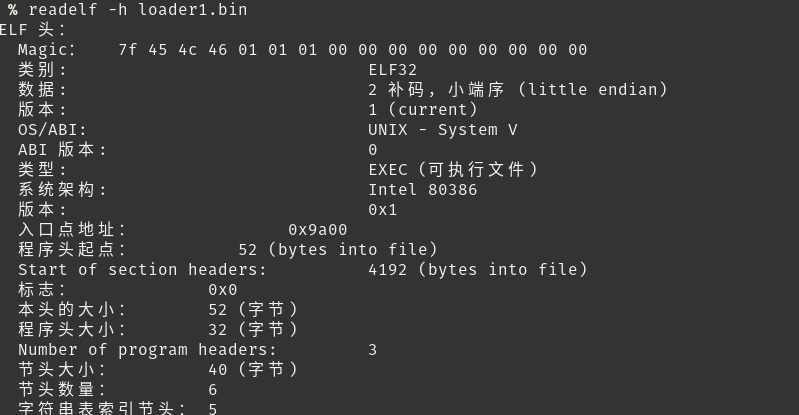
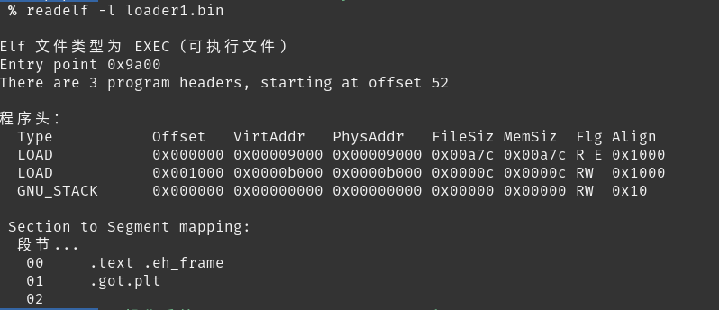
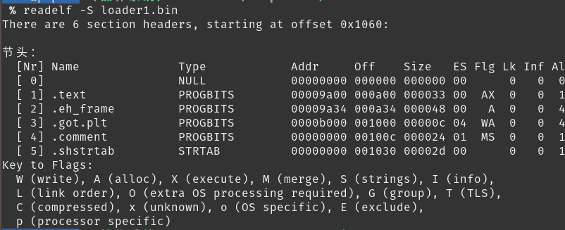
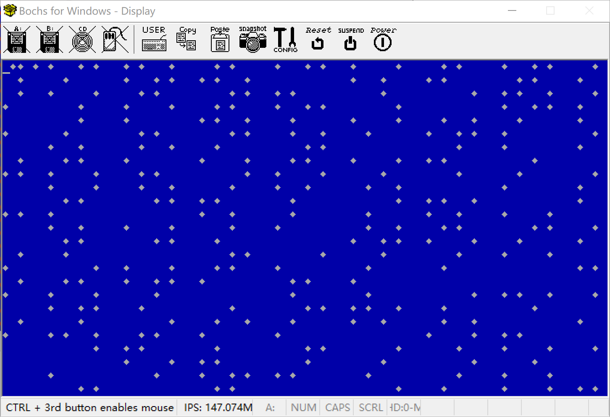

## ELF文件
上次说过了,其实目标文件和可执行文件都是ELF格式文件


**ELF索引表**

ELF 文件包括三个索引表

- ELF Header： ELF文件头

  >作用：
  >
  >1) 指定程序入口
  >
  >2) 定位Program  header  table位置
  >
  >3) 定位Section  header  table位置

- Program  header  table：程序头表。 

  > 作用：
  >
  > 1）查询segment的位置（一个segment可能会包含多个Section）
  >
  > 2）根据此表创建内存中创建映像

- Section  header  table：节区头表。

  > 作用：
  >
  > 1）存储文件节区的信息
  >
  > 2）根据此表定位代码段，数据段位置


**ELF内容区**

- 字符串表：interp，.strtable ，.shstrtab，.dynstr节区
- 符号表：.symtab 
- 代码段：.text节区
- 数据段：.data、.rodata 、.bss节区
- 全局偏移表：.got节区
- 过程链接表： .plt节区
- 哈希表：指.hash节区
- 编译器版信息：.comment 


**ELF字段类型**

- Elf32_Addr：4字节，无符号程序地址

- Elf32_Half： 2字节，无符号中等整数

- Elf32_Off：4 字节，无符号文件偏移 

- Elf32_SWord：4 字节，有符号大整数  

- Elf32_Word ：4字节，无符号大整数   


### ELF的三种Header格式

ELF Header格式

| 字段       |类型 | 长度 | 说明                       |
| ---------- | ---------- |---- | ------------ |
| ident | char [16] | 16 | 魔数 |
| type | Elf32_Half | 2 | 文件类型 |
| machine | Elf32_Half | 2 | 硬件平台 |
| version | Elf32_Word | 4 | 版本 |
| entry | Elf32_Addr | 4 | 程序进入点 <24> |
| phoff | Elf32_Off | 4 | 程序头表偏移量<28> |
| shoff | Elf32_Off | 4 | 节头表偏移量 |
| flags | Elf32_Word | 4 | 处理器特定标志 |
| ehsize | Elf32_Half | 2 | ELF头部大小 |
| phentsize | Elf32_Half | 2 | 程序头大小<42> |
| phnum | Elf32_Half | 2 | 程序头数量<44> |
| shentsize | Elf32_Half | 2 | 节头大小 |
| shnum | Elf32_Half | 2 | 节头数量 |
| shstrndx | Elf32_Half | 2 | 字符串表索引节头 |


### ELF文件分析


查看文件头

> readelf -h loader1.bin




#### Program Header 程序头格式


| 字段       |类型 | 长度 | 说明                       |
| ---------- | ---------- |---- | -------------------------- |
| type | Elf32_Word | 4 | 段类型 |
| offset | Elf32_Off | 4 | 偏移量 <4> |
| vaddr | Elf32_Addr | 4 | 内存虚拟地址 <8> |
| paddr | Elf32_Addr | 4 | 物理地址 |
| filesz | Elf32_Word | 4 | 段大小（文件占用）<16> |
| memsz | Elf32_Word | 4 | 段大小（内存占用） |
| flag | Elf32_Word | 4 | 段标志 |
| align | Elf32_Word | 4 | 段对齐 |

查看程序头：

> $ readelf -l 文件名




#### Section Header节头

节头格式


| 字段       |类型 | 长度 | 说明                       |
| ---------- | ---------- |---- | -------------------------- |
| name | Elf32_Word | 4 | 节名称 |
| type | Elf32_Word | 4 | 节类型 |
| flags | Elf32_Word | 4 | 节属性 |
| addr | Elf32_Addr | 4 | 节区地址 |
| offset | Elf32_Off | 2 | 偏移量 |
| size | Elf32_Word | 4 | 节大小（文件） |
| link | Elf32_Word | 4 |节区头部表索引链接 |
| info | Elf32_Word | 4 | 附加信息 |
| addralign | Elf32_Word | 4 | 地址对齐 |
| entsize | Elf32_Word | 4 | 项目表长度 |


查看字段头：
> $ readelf -S 文件名




#### 符号表 Symbol table


### 其他

- 查看全部信息
  
> readelf -a loaderELF.o

- 查看所有分段大小

> size loaderELF.o

- 查看分段内容

> objdump -s loaderELF.o

- 查看符号表

> objdump -t loaderELF.o

- 反编译

> objdump -S loaderELF.o


### 内存复制


数据传送指令

movsb指令
> movsb : 即字符串传送指令，这条指令按字节送数据。默认复制一个字节/
>
> 参数：
> - esi：数据源地址
> - edi：数据目标地址

rep movsb指令
> rep movsb ： 即字符串传送指令，复制多个字节
>
> 参数：
> - esi：数据源地址
> - edi：数据目标地址
> - ecx：复制字节数、

汇编代码
```assembly
;------------------    
;内存复制 : 源地址，目标地址，字节数
;入参： 
;   esi = 源地址
;   edi = 目标地址
;   ecx = 字节数
MemCopy:
    rep movsb; 
    ret

```


### 解析执行ELF文件

```assembly

;-----------------------------------
; 解析执行ELF文件: AnalyzeELF
; 入参： 
;   eax=文件内存位置
; 出参： 
;   ebx=入口地址
AnalyzeELF:	


    mov edx, 0
    mov ecx, 0
    mov ebx, [eax + 28]			;program header偏移量
    add ebx, eax				;program header位置
    mov dx,  [eax + 42]			;program header大小
    mov cx,  [eax + 44]			;program header数量
   

    .loopSegment:
        cmp byte [ebx + 0],0	;ptype为0，程序段未使用
        je  .nextSegment

    
        push ecx;
        mov  ecx, 0;
        ;---------------
        ;复制segment
        mov esi, [ebx + 4]		;segment偏移量
        add esi, eax			;src
        mov edi, [ebx + 8]		;dist
        mov cx,  [ebx + 16]		;len
        call MemCopy
        pop ecx;
        
    .nextSegment:
        add ebx, edx
        loop .loopSegment		;继续读取下一个segment
        mov ebx, [eax + 24]     ;返回入口地址
        ret

```


调用处的代码

```
;----------------------
;解析并执行ELF文件
AnalyzeKernel:
    mov     eax, KERNEL_BASE_ADDR 
    call    AnalyzeELF
    jmp     ebx  

```


执行的c语言程序
```c
int is_prime(unsigned short n)
{
	//返回1表示素数，返回0表示非素数
	int i = 0;
	for (i = 2; i < n; i++)
	{
		if (n % i == 0)
		{
			return 0;
		}
	}
	return 1;
}

int  _start(){
    unsigned short*   pvga = (unsigned short*)0xb8000;	//填充到显示内存的初始地址	
    for(int i = 0;i <= 0x7fff;i++){
         //char: 0x3 ,color: 0x104
        if(is_prime(i) == 1) {
            *(pvga + i) = (unsigned short)0x1704;		 //显存填充，蓝色背景白色棱形
        } else {
            *(pvga + i) = (unsigned short)0x1700;	 //显存填充背景色
        }
    }
    fin:
    	goto fin;
}


```

Makefile 

```
# tools
PLATFORM=Linux
NASM=nasm
BOCHS=bochs
BXIMAGE=bximage

# args
boot=boot
build=build
ENTRY_POINT=0x10000
CFLAGS=-m32 -c -nostdinc -nostdlib -fno-builtin -Wall -W -Wstrict-prototypes -Wmissing-prototypes
LDFLAGS=-m elf_i386 -s -e _start -Ttext $(ENTRY_POINT) 

target: $(build)/rastos.img	
	@echo "build img completed"

$(build)/rastos.img:$(build)/boot.bin $(build)/loader.bin $(build)/loaderELF.bin
	$(BXIMAGE) -func=create -imgmode=flat -hd=16M -q $(build)/rastos.img 
	sleep 2
	dd if=$(build)/boot.bin of=$(build)/rastos.img bs=512 count=1  conv=notrunc
	dd if=$(build)/loader.bin of=$(build)/rastos.img bs=512 count=1 seek=1 conv=notrunc
	dd if=$(build)/loaderELF.bin of=$(build)/rastos.img bs=512 count=30 seek=2 conv=notrunc


$(build)/loaderELF.bin: $(build)/loaderELF.o
	$(LD) $(build)/loaderELF.o -o $(build)/loaderELF.bin $(LDFLAGS) 

$(build)/loaderELF.o: $(boot)/loaderELF.c
	$(CC) $(boot)/loaderELF.c  -o $(build)/loaderELF.o $(CFLAGS) 

$(build)/%.bin: $(boot)/%.asm
	$(NASM) -f bin -o $(build)/$*.bin $(boot)/$*.asm	

prepare: $(build)
	@echo "prepare dir $(build)"
    ifeq ($(build), $(wildcard $(build)))
		@echo "build directory exist..."
    else
		mkdir -p $(build)
    endif

clean:
	@echo "clean dir $(build)"
	rm -rf $(build)/*

platform:
	@echo $(PLATFORM)
```


加载执行c语言程序的代码并执行




天空任鸟飞，海阔凭鱼跃。我们已经成功的从启动，到进入c语言的世界，接下来就是无限的可能性。