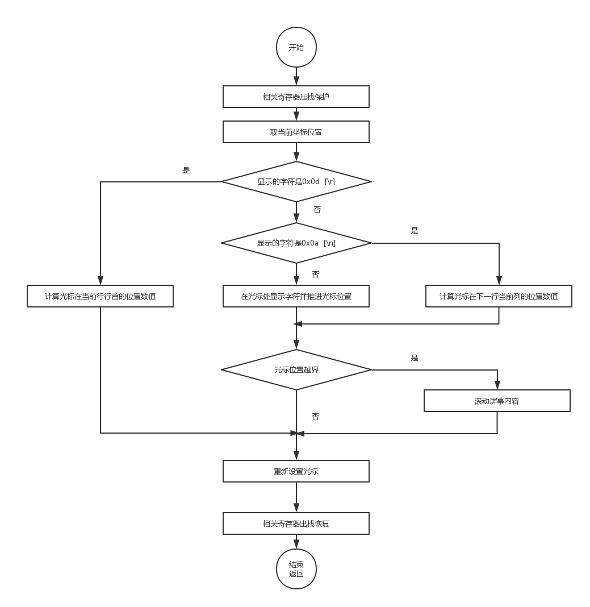
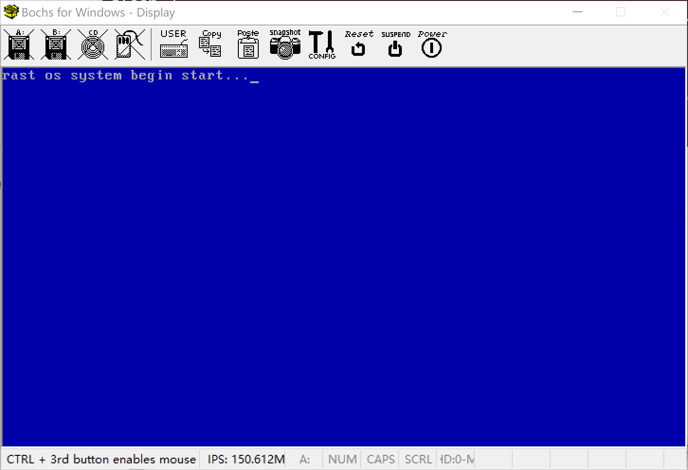

## 打印调试

为了方便测试数据，需要在控制台进行数据输出。linux内核的控制台输出使用printk.c文件，调用vprintf方法。

vprintf方法可以使用参数列表发送格式化输出到标准输出 stdout。

vprintf方法可以使用C语言格式化输出。


## 实现stdout输出

为了简单方便，就不使用c标准库的vprintf方法了。重新定义了简单的控制台输出方法。

创建printk文件，订阅打印方法。

字符打印时，需要对回车，换行，tab，空格等字符进行特殊处理

字符打印流程




## 代码
printk.h
```c
void print_char(char ch);

void print_string(char* str);

void print_int16(int16 num);

void print_int32(int32 num);

void print_int64(int64 num);

void print_pointer(uint32 addr);
```

printk.c
```c


#include "../include/stdint.h"
#include "../include/io.h"
#include "../include/printk.h"

#define VGA_BASE 0xB8000
#define ROW 25
#define COL 80

static char printBuf[1024];

uint16 get_cursor()
{   
    //get high cursor value
    io_out8(0x3d4, 0x0e);
    uint8 cursor_high = io_in8(0x3d5);
    //get low cursor value
    io_out8(0x3d4, 0x0f);
    uint8 cursor_low = io_in8(0x3d5);
    //high + low
    return (cursor_high << 8) + (cursor_low & 0xff);
}

void set_cursor(uint16 pos)
{
    uint8 cursor_high = pos >> 8;
    uint8 cursor_low = pos & 0xff;
    //set high cursor value
    io_out8(0x3d4, 0x0e);
    io_out8(0x3d5, cursor_high);
    //set low cursor value
    io_out8(0x3d4, 0x0f);
    io_out8(0x3d5, cursor_low);
}


void print_char(char ch)
{

    uint16 pos = get_cursor();
    char *pvga = (char *)VGA_BASE;

    //字符
    switch (ch)
    {
        case 0x0d: //RETURN
            pos = (pos / COL) * COL;
            break;
        case 0x0a: //NEW LINE
            pos = pos + COL;
            pos = (pos / COL) * COL;
            break;
        case 0x09: //TAB
            pos=pos+4;
            break;
        case 0x08: //BACKSPACE
            pos--;
            *(pvga + pos * 2) = 0x00;
            break;
        default:
            *(pvga + pos * 2) = ch;
            *(pvga + pos * 2 + 1) = 0x17; //蓝底白字
            pos++;
    }
    //字符超出时, 滚屏
    if (pos + 1 > ROW * COL )
    {
        int display = (ROW -1) * COL;
        pos = pos - COL;
        for (int i = 0; i < display; i++)
        {
            *(pvga + 0x00 + i * 2) = *(pvga + 0xa0 + i * 2);
        }
        for (int i = 0; i < COL ; i++)
        {
            *(pvga + display * 2 + i * 2) = 0x0;
        }
    }
    set_cursor(pos);
}

void print_string(char *chs)
{
    int i = 0;
    while (*(chs + i) != 0)
    {
        print_char(*(chs + i));
        i++;
    }
}


void print_int16(int16 num)
{
    int i = 0;
    char *chs = (char *)printBuf; //need point mem alloc
    do
    {
        *(chs + i) = (char)(num % 10 + '0'); //取下一个数字
        i++;

    } while ((num /= 10) > 0); //删除该数字
    for (int j = i-1; j >= 0; j--)
    { //生成的数字是逆序的，所以要逆序输出
        print_char(*(chs + j));
        *(chs + j) = 0;
    }
}

void print_int32(int32 num)
{
    int i = 0;
    char *chs = (char *)printBuf; //need point mem alloc
    do
    {
        *(chs + i) = (char)(num % 10 + '0'); //取下一个数字
        i++;

    } while ((num /= 10) > 0); //删除该数字
    for (int j = i-1 ; j >= 0; j--)
    { //生成的数字是逆序的，所以要逆序输出
        print_char(*(chs + j));
        *(chs + j) = 0;
    }
}

void print_int64(int64 num)
{
    //32位系统计算64位无法直接运行，需要自己实现方法，先留空
}

void print_pointer(uint32 addr)
{   
    print_char('0');
    print_char('x');
    int i = 0;
    char *chs = (char *)printBuf; //need point mem alloc
    do
    {
        int ch = addr % 16;
        if(ch==0x0f) {
            *(chs + i)='F';
        } else if(ch==0x0e) {
            *(chs + i)='E';
        } else if(ch==0x0d) {
            *(chs + i)='D';
        } else if(ch==0x0c) {
            *(chs + i)='C';
        }  else if(ch==0x0b) {
            *(chs + i)='B';
        } else if(ch==0x0a) {
            *(chs + i)='A';
        } else {
            *(chs + i) = (char)(addr % 16 + '0'); //取下一个数字
        }
        i++;

    } while ((addr /= 16) > 0); //删除该数字
    for (int j = 7; j > i-1; j--)
    { //补充0
        print_char('0');
        *(chs + j) = 0;
    }
    for (int j = i-1; j >= 0; j--)
    { //生成的数字是逆序的，所以要逆序输出
        print_char(*(chs + j));
        *(chs + j) = 0;
    }
}


```


修改加载文件，输出打印调试信息
```c
#include "../include/printk.h"

int  _start(){
    print_string("rast os system begin start...\0");
    fin:
    	goto fin;
}
```


显示结果如下：





Makefile文件更新
Makefile
```
# tools
PLATFORM=Linux
NASM=nasm
BOCHS=bochs
BXIMAGE=bximage

# args
boot=boot
asm=asm
lib=lib
build=build
ENTRY_POINT=0x10000 
CFLAGS=-m32 -c -nostdinc -nostdlib -fno-builtin -Wall -W -Wstrict-prototypes -Wmissing-prototypes
LDFLAGS=-m elf_i386 -s -e _start -Ttext $(ENTRY_POINT) 

target: $(build)/rastos.img	
	@echo "build img completed"

$(build)/rastos.img:$(build)/boot.bin $(build)/loader.bin $(build)/loaderELF.bin
	$(BXIMAGE) -func=create -imgmode=flat -hd=16M -q $(build)/rastos.img 
	sleep 2
	dd if=$(build)/boot.bin of=$(build)/rastos.img bs=512 count=1  conv=notrunc
	dd if=$(build)/loader.bin of=$(build)/rastos.img bs=512 count=1 seek=1 conv=notrunc
	dd if=$(build)/loaderELF.bin of=$(build)/rastos.img bs=512 count=30 seek=2 conv=notrunc


$(build)/loaderELF.bin: $(build)/loaderELF.o  $(build)/io.o $(build)/printk.o
	$(LD) -o $@  $^  $(LDFLAGS) 

$(build)/loaderELF.o: $(boot)/loaderELF.c
	$(CC) $(boot)/loaderELF.c  -o $(build)/loaderELF.o $(CFLAGS) 

$(build)/io.o: 
	$(NASM) -f elf -o $(build)/io.o $(asm)/io.asm

$(build)/%.bin: $(boot)/%.asm
	$(NASM) -f bin -o $(build)/$*.bin $(boot)/$*.asm	

$(build)/%.o: 
	$(CC) -o $(build)/$*.o  $(lib)/$*.c -I include $(CFLAGS) 

prepare: $(build)
	@echo "prepare dir $(build)"
    ifeq ($(build), $(wildcard $(build)))
		@echo "build directory exist..."
    else
		mkdir -p $(build)
    endif

clean:
	@echo "clean dir $(build)"
	rm -rf $(build)/*

platform:
	@echo $(PLATFORM)
```