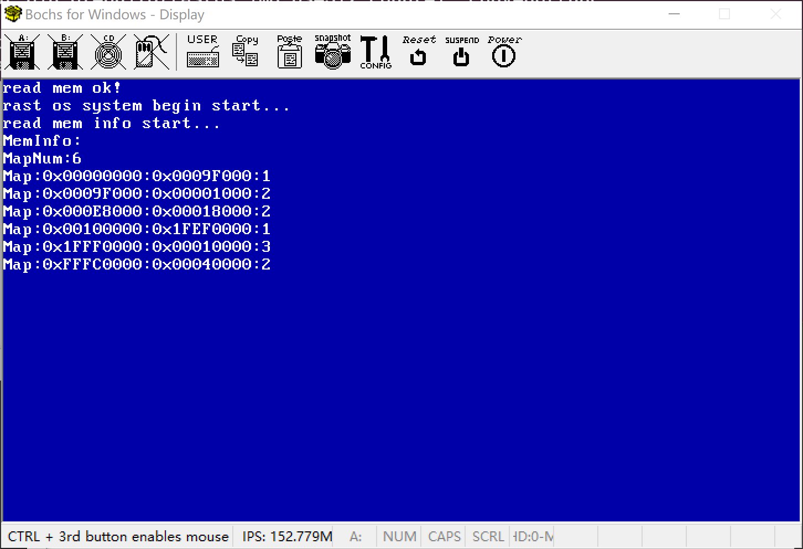

## 检测内存大小

因为需要使用BIOS中断，所以应该在实模式下获取内存信息，并存在固定的内存位置，然后在保护模式下解析出内存信息：

**INT 15H**：System Service 系统服务中断

功能如下三种：

- AH = 0x88 ：检测内存大小，最多检测出64MB。

>入口参数：
> AH = 0x88
> 
>出口参数：
> CF=表示为标志位，0调用成功，1调用出错
> AX=扩展内存字节数(以1KB为单位)，不包含低端的1MB内存


- AX= 0xE801 : 检测内存大小，最多检测出4GB内存。

 >入口参数：
 >
 > AX= 0xE801
 > 出口参数：
 > CF=表示为标志位，0调用成功，1调用出错
 > AX=扩展内存字节数(以1KB为单位)，存储15M以下的容量大小.
 > BX=扩展内存字节数(以64KB为单位)，存储16MB-4GB的容量大小.
    

- EAX=0xE820: 检测内存大小, 全部内存大小

 >入口参数：
 > EAX= 0xE820
 > EBX=0, ARDS 的后继值,第一次调用设置为0
 > ECX=20 , ARDS字节大小.
 > EDX=0x534D4150, 签名标记的默认值.代表字符串SMAP的ASCII码.
 >ES: DI= ARDS缓冲区地址,内存信息会写入此区域
 >
 >出口参数：
> CF=表示为标志位，0调用成功，1调用出错
> EAX=0x534D4150, 签名标记的默认值.
> EBX= X, ARDS 的后继值, BIOS自动修改调整, 次寄存器无需手动修改. 如果返回为0,表示已经是最后一个 ARDS 的结构.
> ES: DI= ARDS缓冲区地址, 和输入值一样. 内存信息已经被写入此区域.


## ARDS结构 (20个字节)
调用内存中断后，BIOS将内存信息存在指定地址，其数据格式为ARDS结构。如下：

| Offset | Name         | Description |
| ------ | ------------ | ----------- |
| 0-4    | BaseAddrLow  | 基地址的低32位    |
| 4-8    | BaseAddrHigh | 基地址的高32位    |
| 8-12   | LengthLow    | 长度(字节)的低32位 |
| 12-16  | LengthHigh   | 长度(字节)的高32位 |
| 16-20  | Type         | 这个地址范围的地址类型 |

其中Type的取值及其意义如下:
>Type取值
>1: AddressRangeMemory,这个内存段是一段可以被OS使用的RAM
>2:AddressRangeReserved,这个地址段正在被使用,或者被系统保留,所以一定不要被OS使用
>Other: Undefined,保留为未来使用,任何其它值都必需被OS认为是AddressRangeReserved

定义结构如下：


```c
struct e820map {
	int map_num;
    struct {
        long long addr;
        long long size;
        long type;
    } map[E820MAX];
};
```


```
## 中断获取内存信息

因为需要使用int中断获取内存，所以必须回到实模式下。在loader.bin文件中读取内存信息并存储到一个固定位置。指定0x1000位置


代码:

boot.inc

```assembly
INFO_MEM_ADDR  equ 0x1000
```


loader.asm
```
    ;----------------------
    ;获取内存信息到0x0000
    ;----------------------
    mov ax, INFO_MEM_ADDR/16
    mov es, ax
    mov di, 4
    call  ReadMemInfo    
```

ReadMemInfo方法

```asm
[bits 16]
;----------------------------
;读取内存信息, 读取到 0x0000
;es:di 读取后存储到的内存地址
;----------------------------
ReadMemInfo:
    mov dword [INFO_MEM_ADDR], 0
    mov edx, 0x0534d4150
    mov ebx, 0
    
  .mem_get_loop:                 
    mov eax, 0x0e820  ; 检测内存大小
    mov ecx, 128
    int 0x15
    jc .mem_get_fail
    add di,20
    inc dword [INFO_MEM_ADDR]          ;记录内存ADS数量
    cmp ebx, 0                          ;ebx为0代表全部查找完成
    jnz .mem_get_loop
    jmp .mem_get_ok
  .mem_get_fail:
    mov si,ReadMemFail          ; 地址放入si
    mov dh,0                    ; 设置显示行
    mov dl,0                    ; 设置显示列
    call PrintString            ; 调用函数
    jmp $
  .mem_get_ok: 
    ;mov si,ReadMemOk            ; 地址放入si
    ;mov dh,0                    ; 设置显示行
    ;mov dl,0                    ; 设置显示列
    ;call PrintString            ; 调用函数
    ret


; ------------------------------------------------------------------------
; 显示字符串函数:PrintString
; 参数:
; si = 字符串开始地址,
; dh = 第N行，0开始
; dl = 第N列，0开始
; ------------------------------------------------------------------------
PrintString:
			mov cx,0			;BIOS中断参数：显示字符串长度
			mov bx,si
	.s1:;获取字符串长度
			mov al,[bx]			;读取1个字节到al
			add bx,1			;读取下个字节
			cmp al,0			;是否以0结束
			je .s2
			add	cx,1			;计数器
			jmp .s1
	.s2:;显示字符串
			mov bx,si
			mov bp,bx
			mov ax,ds
			mov es,ax			;BIOS中断参数：计算[ES:BP]为显示字符串开始地址

			mov ah,0x13			;BIOS中断参数：显示文字串
			mov al,0x01			;BIOS中断参数：文本输出方式(40×25 16色 文本)
			mov bh,0x0			;BIOS中断参数：指定分页为0
			mov bl,0x1F			;BIOS中断参数：指定白色文字			
			mov dl,0			;列号为0
			int 0x10			;调用BIOS中断操作显卡。输出字符串
			ret

; ------------------------------------------------------------------------
; 字符串常量
; ------------------------------------------------------------------------
ReadMemFail: db "read mem fail!",0x0D,0x0A,0
ReadMemOk:  db "read mem ok!",0x0D,0x0A,0
    
```


## 在C语言中读取内存信息

我们在loadELF.bin文件尝试读取获取的内存大小

mem.h
```c
#ifndef __LIB_MEM_H
#define __LIB_MEM_H

#define MEM_INFO_ADDR  0x1000
#define E820MAX	128

#include "stdint.h"

struct e820map {
	int map_num;
    struct {
        uint32 addr;
        uint32 addr_unused;
        uint32 size;
        uint32 size_unused;
        uint32 type;
    } map[E820MAX];
};

void init_mem(void);

#endif
```

mem.c
```c
#include "../include/mem.h"
#include "../include/printk.h"

void init_mem(){

    //获取内存信息
    struct e820map *mem_info = (struct e820map *) MEM_INFO_ADDR;
    print_string("MemInfo:\n");
    print_string("MapNum:");
    print_int16(mem_info->map_num);
    print_char('\n');

    //打印内存信息
    for(int i = 0; i<mem_info->map_num;i++) {
        print_string("Map:");
        print_pointer(mem_info->map[i].addr);
        print_string(":");
        print_pointer(mem_info->map[i].size);
        print_string(":");
        print_int32(mem_info->map[i].type);
        print_string("\n");
    }

}
```


执行打印 
```c
#include "../include/printk.h"
#include "../include/mem.h"

int  _start(){
    print_string("rast os system begin start...\n");
    print_string("read mem info start...\n");
    init_mem();
    fin:
    	goto fin;
}
```

结果如下：




转换内容：

地址1：start= 0x00000 ,len= 0x9F000,type=1

地址2：start= 0x9F000 ,len= 0x1000,type=2(系统保留)

地址3：start= 0xE8000 ,len= 0x18000,type=2(系统保留)

地址4：start=0x100000, len=0x1EF0000,type=1

地址5：start=0x1FF0000, len=0x100000,type=3

地址6：start=0xFFFC0000, len=0x40000,type=2(系统保留)


