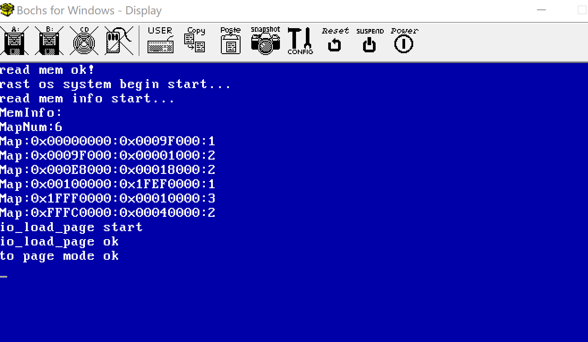
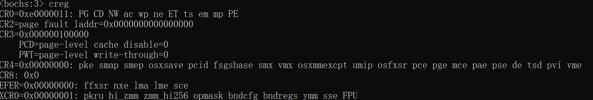
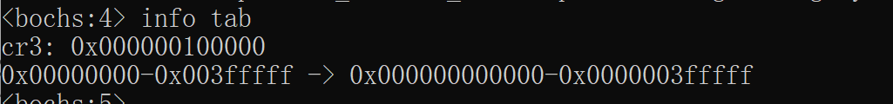

## 页目录基址

定义页目录基址为0x100000位置。将此区域设置页目录的保存地址。在0x100000此处写入分页信息。

创建1个临时分页，此临时分页大小为4G，并且线性地址和物理地址从0开始一一对应。


## 代码：

io.h
```c
void io_load_page(uint32 pte_addr);

void io_to_page();
```

io.asm
```c

global io_load_page, io_to_page

io_load_page:   ;void io_load_page(uint32 pde_address) 
    ;cr3
    mov edx, [esp+4]
    mov cr3, edx
    ret

 io_switch_page:     ;void io_switch_page(void)
    ;cr0
    mov eax, cr0
    or eax, 0x80000000   ;设置第31位为1
    mov cr0, eax
    ret
```


page.h
```c
#ifndef __LIB_PAGE_H
#define __LIB_PAGE_H

#define PDE_START  0x100000
#define PTE_START  0x101000

#define PG_P  1
#define PG_RW_R  0 
#define PG_RW_W  1 << 1
#define PG_US_S  0
#define PG_US_U  1 << 2
#define PG_PDE_ATTR PG_US_U | PG_RW_W | PG_P
#define PG_PTE_ATTR PG_US_U | PG_RW_W | PG_P


void init_page();

#endif
```

page.c
```c

#include "../include/stdint.h"
#include "../include/io.h"
#include "../include/mem.h"
#include "../include/printk.h"

void init_page(){

    //页目录
    uint32 *page_dir = (uint32 *)PDE_START;
    for(int i=0;i<1024;i++){
        *(page_dir+i) = {0};
    }

    //页表
    uint32 *page_table_dir = (uint32 *)PTE_START;
    for(int i=0;i<1024;i++){
        *(page_table_dir+i) = {0};
    }
    
    //初始化临时分页
    for(int i=0;i<1024;i++){
        *(page_table_dir+i) = { (i * 0x1000) | PG_PTE_ATTR };
    }
    *(page_dir) = { PTE_START | PG_PTE_ATTR };

    //调用汇编，设置cr3和cr0，进入分页模式
    print_string("io_load_page start\n");
    io_load_page(PDE_START);
    print_string("io_load_page ok\n");
    io_switch_page();
    print_string("to page mode ok\n");
}
```


运行结果


## 分页调试
1）查看是否分页模式切换成功
bochs执行creg。查看PG位是否为1，为1则开启成功


执行info tab，查看创建好的临时分页

