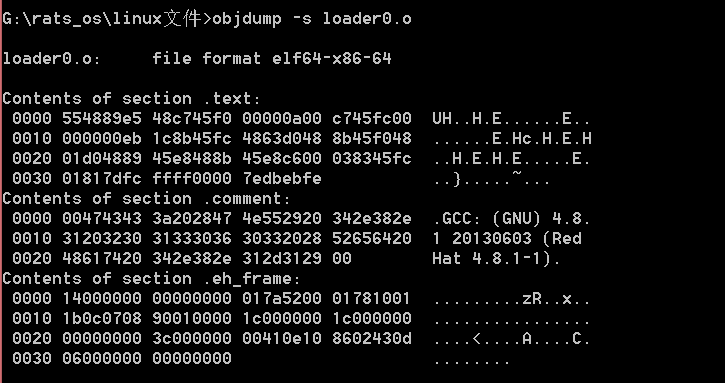
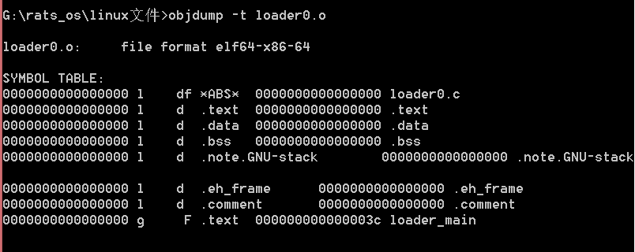

## ELF文件
上次说过了,其实目标文件和可执行文件都是ELF格式文件


**ELF索引表**

ELF 文件包括三个索引表

- ELF Header： ELF文件头

  >作用：
  >
  >1) 指定程序入口
  >
  >2) 定位Program  header  table位置
  >
  >3) 定位Section  header  table位置

- Program  header  table：程序头表。 

  > 作用：
  >
  > 1）查询segment的位置（一个segment可能会包含多个Section）
  >
  > 2）根据此表创建内存中创建映像

- Section  header  table：节区头表。

  > 作用：
  >
  > 1）存储文件节区的信息
  >
  > 2）根据此表定位代码段，数据段位置


**ELF内容区**

- 字符串表：interp，.strtable ，.shstrtab，.dynstr节区
- 符号表：.symtab 
- 代码段：.text节区
- 数据段：.data、.rodata 、.bss节区
- 全局偏移表：.got节区
- 过程链接表： .plt节区
- 哈希表：指.hash节区
- 编译器版信息：.comment 


**ELF字段类型**

- Elf32_Addr：4字节，无符号程序地址

- Elf32_Half： 2字节，无符号中等整数

- Elf32_Off：4 字节，无符号文件偏移 

- Elf32_SWord：4 字节，有符号大整数  

- Elf32_Word ：4字节，无符号大整数   


### ELF的三种Header格式

ELF Header格式

| 字段       |类型 | 长度 | 说明                       |
| ---------- | ---------- |---- | ------------ |
| ident | char [16] | 16 | 魔数 |
| type | Elf32_Half | 2 | 文件类型 |
| machine | Elf32_Half | 2 | 硬件平台 |
| version | Elf32_Word | 4 | 版本 |
| entry | Elf32_Addr | 4 | 程序进入点 <24> |
| phoff | Elf32_Off | 4 | 程序头表偏移量<28> |
| shoff | Elf32_Off | 4 | 节头表偏移量 |
| flags | Elf32_Word | 4 | 处理器特定标志 |
| ehsize | Elf32_Half | 2 | ELF头部大小 |
| phentsize | Elf32_Half | 2 | 程序头大小<42> |
| phnum | Elf32_Half | 2 | 程序头数量<44> |
| shentsize | Elf32_Half | 2 | 节头大小 |
| shnum | Elf32_Half | 2 | 节头数量 |
| shstrndx | Elf32_Half | 2 | 字符串表索引节头 |


### ELF文件分析


查看文件头

> readelf -h loader1.bin


#### Program Header 程序头格式


| 字段       |类型 | 长度 | 说明                       |
| ---------- | ---------- |---- | -------------------------- |
| type | Elf32_Word | 4 | 段类型 |
| offset | Elf32_Off | 4 | 偏移量 <4> |
| vaddr | Elf32_Addr | 4 | 内存虚拟地址 <8> |
| paddr | Elf32_Addr | 4 | 物理地址 |
| filesz | Elf32_Word | 4 | 段大小（文件占用）<16> |
| memsz | Elf32_Word | 4 | 段大小（内存占用） |
| flag | Elf32_Word | 4 | 段标志 |
| align | Elf32_Word | 4 | 段对齐 |

查看程序头：

> $ readelf -l 文件名


#### Section Header节头

节头格式


| 字段       |类型 | 长度 | 说明                       |
| ---------- | ---------- |---- | -------------------------- |
| name | Elf32_Word | 4 | 节名称 |
| type | Elf32_Word | 4 | 节类型 |
| flags | Elf32_Word | 4 | 节属性 |
| addr | Elf32_Addr | 4 | 节区地址 |
| offset | Elf32_Off | 2 | 偏移量 |
| size | Elf32_Word | 4 | 节大小（文件） |
| link | Elf32_Word | 4 |节区头部表索引链接 |
| info | Elf32_Word | 4 | 附加信息 |
| addralign | Elf32_Word | 4 | 地址对齐 |
| entsize | Elf32_Word | 4 | 项目表长度 |


查看字段头：
> $ readelf -S 文件名


#### 符号表 Symbol table


### 其他

- 查看全部信息

  > ```
  > readelf -a
  > ```


- 查看所有分段大小

> size  loader0.o


- 查看分段内容

> objdump -s loader0.o



- 查看符号表

> objdump -t loader0.o



- 反编译

  > objdump -S loader0.o

