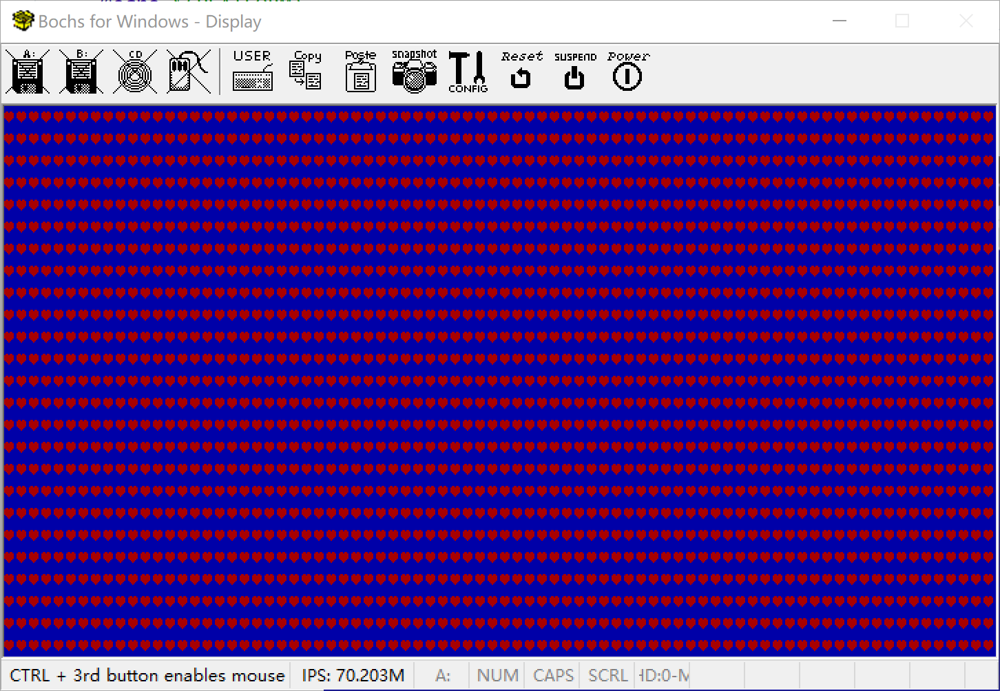

##  解析ELF文件


### 准备工作

输出心形的c语言代码

kernel/main.c

```c
typedef unsigned char int8;

int _start(){
    int8 *pvga = (int8 *)0xb8000;	//填充到显示内存的初始地址	
    for(int i = 0;i <= 0xffff;){
         //char: 0x3 ,color: 0x104
        *(pvga + i) = (int8)0x03;i++;		 //符号：心形	
        *(pvga + i)=  (int8)0x14;i++;        //颜色：背景蓝前景红
    }
    fin:
    	goto fin;
}
```


### 内存复制


数据传送指令

movsb即字符串传送指令，这条指令按字节送数据。

参数：

esi：数据源地址
edi：数据目标地址

默认复制一个字节

rep movsb ： 复制多个字节

参数：
- esi：数据源地址

- edi：数据目标地址

- ecx：复制字节数


```assembly
;------------------    
;内存复制 : 源地址，目标地址，字节数
;入参： 
;   esi = 源地址
;   edi = 目标地址
;   ecx = 字节数
MemCopy:
    rep movsb; 
    ret

```


### 解析执行ELF文件

```assembly

;-----------------------------------
; 解析执行ELF文件: AnalyzeELF
; 入参： 
;   eax=文件内存位置
; 出参： 
;   ebx=入口地址
AnalyzeELF:	


    mov edx, 0
    mov ecx, 0
    mov ebx, [eax + 28]			;program header偏移量
    add ebx, eax				;program header位置
    mov dx,  [eax + 42]			;program header大小
    mov cx,  [eax + 44]			;program header数量
   

    .loopSegment:
        cmp byte [ebx + 0],0	;ptype为0，程序段未使用
        je  .nextSegment

    
        push ecx;
        mov  ecx, 0;
        ;---------------
        ;复制segment
        mov esi, [ebx + 4]		;segment偏移量
        add esi, eax			;src
        mov edi, [ebx + 8]		;dist
        mov cx,  [ebx + 16]		;len
        call MemCopy
        pop ecx;
        
    .nextSegment:
        add ebx, edx
        loop .loopSegment		;继续读取下一个segment
        mov ebx, [eax + 24]     ;返回入口地址
        ret


;------------------    
;内存复制 : 源地址，目标地址，字节数
;入参： 
;   esi = 源地址
;   edi = 目标地址
;   ecx = 字节数
MemCopy:
    rep movsb; 
    ret
```


调用处的代码

```assembly
;----------------------
;解析并执行ELF文件
AnalyzeKernel:
    mov     eax, KERNEL_BASE_ADDR 
    call    AnalyzeELF
    jmp     ebx  

```


Makefile 

```makefile
# tools
PLATFORM=Linux
NASM=nasm
BOCHS=bochs
BXIMAGE=bximage


# args
boot=boot
kernel=kernel
build=build
ENTRY_POINT =  0x70000
CFLAGS = -m32 -c  # --Wall -W  fno-builtin -Wstrict-prototypes -Wmissing-prototypes 
LDFLAGS = -m elf_i386 -e _start -Ttext $(ENTRY_POINT) 

target: prepare $(build)/gloxos.img	
	@echo "build img completed"

$(build)/gloxos.img: $(build)/boot.bin $(build)/loader.bin $(build)/kernel.bin
	$(BXIMAGE) -mode=create   -imgmode=flat  -hd=16M  -q $(build)/gloxos.img 
	sleep 2
	dd if=$(build)/boot.bin of=$(build)/gloxos.img bs=512 count=1  conv=notrunc
	dd if=$(build)/loader.bin of=$(build)/gloxos.img bs=512 count=1 seek=1 conv=notrunc
	dd if=$(build)/kernel.bin of=$(build)/gloxos.img bs=512 count=25 seek=5 conv=notrunc


$(build)/kernel.bin: $(build)/kernel.o
	$(LD) $(build)/main.o -o $(build)/kernel.bin $(LDFLAGS) 

$(build)/kernel.o: $(kernel)/main.c
	$(CC) $(kernel)/main.c  -o $(build)/main.o    $(CFLAGS) 

$(build)/%.bin: $(boot)/%.asm
	$(NASM) -f bin -o $(build)/$*.bin $(boot)/$*.asm	

prepare:
	@echo "prepare dir $(build)"
    ifeq ($(build), $(wildcard $(build)))
		@echo "build directory exist..."
    else
		mkdir -p $(build)
    endif

clean:
	@echo "clean dir $(build)"
	rm -rf $(build)/*

platform:
	@echo $(PLATFORM)
```


加载执行c语言程序的代码并执行




天空任鸟飞，海阔凭鱼跃。我们已经成功的从启动，到进入c语言的世界，接下来就是无限的可能性。