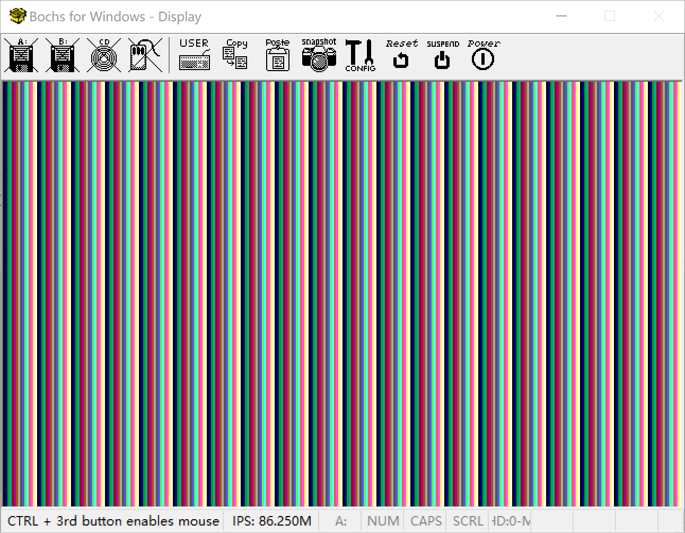

# VGA显示模式


## VGA图形模式

如果想要改变显示方式，你可以通过BIOS中断来设置显示模式。

参考BIOS中断大全，随便列出几个

#### 1. 设置VGA显示模式

**中断操作：INT 0x10，AH＝00H**

|寄存器|说明|值|
|---|---|---|
|AH|操作模式：设置显示模式|00H|
|AL|显示模式||

**AL = 显示模式值**
见下表所示

寄存器值|分辨率|颜色域|显示模式
---|---|---|---
00H |40×25		| 16色	| 文本
01H |40×25		| 16色	| 文本
02H |80×25		| 16色	| 文本
03H |80×25	 	| 16色	| 文本
11H |640×480	| 2色 	| 图形
12H |640×480	| 16色 	| 图形
13H |320x200	| 256色	| 图形


### 设置显示模式

接下来一步我们将设置从文本模式，变为图形显示模式

核心代码: 


```assembly
  ;----------------------------
  ;设置显示模式  320x200x256色
  ;----------------------------
  mov ah, 0x0             	;VGA显示模式
  mov al, 0x13		    	;320x200x256色	
  int 0x10	
```


### 图形模式下的内存映射


| 内存地址           | 空间大小 | 用途             |
| ------------------ | -------- | ---------------- |
| 0xA0000 ~ 0xAFFFF   | 64KB     | 彩色模式显示内容 |
| 0xB0000 ~ 0xB7FFF | 32KB     | 黑白显示内容     |
| 0xB8000 ~ 0xBFFFF  | 32KB     | 文本模式显示内容 |
| 0xC0000 ~ 0xC7FFF  | 32KB     | 显示器适配BIOS   |
| 0xC8000 ~ 0xEFFFF  |  160KB  | 硬件适配器ROM |
|0xF0000 ~ 0xFFFFF | 64KB | BIOS程序。BOIS入口地址为: 0xF0000-0xFFFFF |


所有在图形模式下。修改0xa0000 - 0xaffff则可以改编显示内容

```
typedef unsigned char int8;

int _start(){
    int8 *pvga = (int8 *)0xa0000;	//填充到显示内存的初始地址	
    for(int i = 0;i <= 0xffff;i++){	
		  *(pvga + i) = i & 0x0F;     //显卡内存存填充颜色值	
    }
    fin:
    goto fin;
}
```


或者

> 0xe0000000-0xe00140000

```assembly
 ;----------------------------
 ;设置显示模式  1280×1024*256色
 ;----------------------------
  mov ax, 0x4F02            ;超级VGA显示器模式
  mov bx, 0x107		    
  int	0x10	
```


仿照30天里面，制作彩条图形输出

```assembly
typedef unsigned char int8;

int _start(){
    int8 *pvga = (int8 *)0xe0000000;	//填充到显示内存的初始地址	
    for(int i = 0;i <= 0x140000;i++){	
		  *(pvga + i) = i & 0x0F;     //显卡内存存填充颜色值	
    }
    fin:
    goto fin;
}
```

·


加载执行c语言程序的代码并执行



