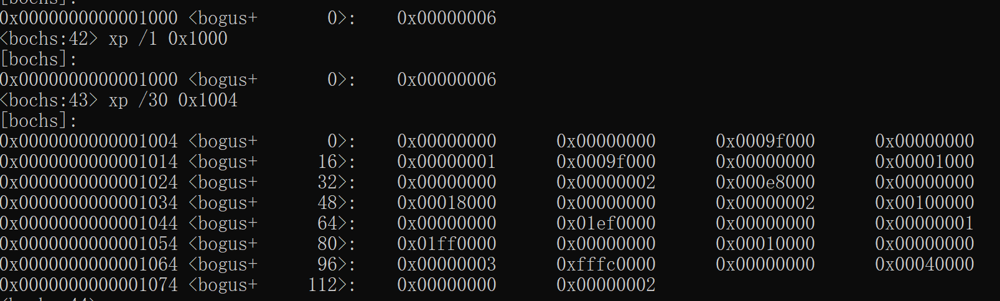

# 内存信息


## 检测内存大小

使用中断：

**INT 15H**：System Service 系统服务中断

功能：

- AH = 0x88 ：检测内存大小，最多检测出64MB。

    入口参数：

    > AH = 0x88

    出口参数：

    > CF=表示为标志位，0调用成功，1调用出错
    >
    > AX=扩展内存字节数(以1KB为单位)，不包含低端的1MB内存


- AX= 0xE801 : 检测内存大小，最多检测出4GB内存。

    入口参数：

    > AX= 0xE801

      出口参数：

    >CF=表示为标志位，0调用成功，1调用出错
    >
    >AX=扩展内存字节数(以1KB为单位)，存储15M以下的容量大小.
    >
    >BX=扩展内存字节数(以64KB为单位)，存储16MB-4GB的容量大小.
    
    


- EAX=0xE820: 检测内存大小, 全部内存大小

    入口参数：

    > EAX= 0xE820
    >
    > EBX=0, ARDS 的后继值,第一次调用设置为0
    >
    > ECX=20 , ARDS字节大小.
    >
    > EDX=0x534D4150, 签名标记的默认值.代表字符串SMAP的ASCII码.
    >
    > ES: DI= ARDS缓冲区地址,内存信息会写入此区域
    >
    > 

      出口参数：

    >CF=表示为标志位，0调用成功，1调用出错
    >
    >EAX=0x534D4150, 签名标记的默认值.
    >
    >EBX= X, ARDS 的后继值, BIOS自动修改调整, 次寄存器无需手动修改. 如果返回为0,表示已经是最后一个 ARDS 的结构.
    >
    >ES: DI= ARDS缓冲区地址, 和输入值一样. 内存信息已经被写入此区域.


## ARDS结构 (20个字节)

| ***\*Offset\**** | ***\*Name\**** | ***\*Description\****  |
| ---------------- | -------------- | ---------------------- |
| 0-4              | BaseAddrLow    | 基地址的低32位         |
| 4-8              | BaseAddrHigh   | 基地址的高32位         |
| 8-12             | LengthLow      | 长度(字节)的低32位     |
| 12-16            | LengthHigh     | 长度(字节)的高32位     |
| 16-20            | Type           | 这个地址范围的地址类型 |


其中Type的取值及其意义如下:

| ***\*Value\**** | ***\*Name\****       | ***\*Description\****                                        |
| --------------- | -------------------- | ------------------------------------------------------------ |
| 1               | AddressRangeMemory   | 这个内存段是一段可以被OS使用的RAM                            |
| 2               | AddressRangeReserved | 这个地址段正在被使用,或者被系统保留,所以一定不要被OS使用     |
| Other           | Undefined            | 保留为未来使用,任何其它值都必需被OS认为是AddressRangeReserved |


代码:

boot.inc

```assembly
INFO_MEM_START  equ 0x1000
```


loader.asm

```asm

;----------------------------
;读取内存信息, 读取到 0x1000
;es:di 读取后存储到的内存地址
;----------------------------
ReadMemInfo:
    mov dword [INFO_MEM_START], 0
    mov edx, 0x0534d4150
    mov ebx, 0
    
  .mem_get_loop:                 
    mov eax, 0x0e820  ; 检测内存大小
    mov ecx,20		  ; ARDS字节大小.
    int 0x15
    jc .mem_get_fail
    add di,20
    inc dword [INFO_MEM_START]          ;记录内存ADS数量
    cmp ebx, 0                          ;ebx为0代表全部查找完成
    jnz .mem_get_loop
    jmp .mem_get_ok
  .mem_get_fail:
    mov si,ReadMemFail         ; 地址放入si
    mov dh,1                    ; 设置显示行
    mov dl,0                    ; 设置显示列
    call PrintString            ; 调用函数
    jmp $
  .mem_get_ok: 
    mov si,ReadMemSuccess            ; 地址放入si
    mov dh,1                    ; 设置显示行
    mov dl,0                    ; 设置显示列
    call PrintString            ; 调用函数
    ret
    
    
io_pre_read_mem:      ; void io_read_mem(uint64 p_gdt)
    mov eax, [esp+4]
    mov edx, 0x0534d4150
    mov ebx, 0
    mov eax, 0x0e820  ; 检测内存大小
    mov ecx,20		  ; ARDS字节大小.
    ret
    
io_read_mem:      ; void io_read_mem(uint64 p_gdt)
    mov eax, [esp+4]
    mov edx, 0x0534d4150
    mov ebx, 0
    mov eax, 0x0e820  ; 检测内存大小
    mov ecx,20		  ; ARDS字节大小.
    ret        
```




转换内容：

地址1：start= 0x00000 ,len= 0x9F000,type=1

地址2：start= 0x9F000 ,len= 0x1000,type=2(系统保留)

地址3：start= 0xE8000 ,len= 0x18000,type=2(系统保留)

地址4：start=0x100000, len=0x1EF0000,type=1

地址5：start=0x1FF0000, len=0x100000,type=3

地址6：start=0xFFFC0000, len=0x40000,type=2(系统保留)


```
struct e820map {
	int map_num;
    struct {
        long long addr;
        long long size;
        long type;
    } map[E820MAX];
};
```

